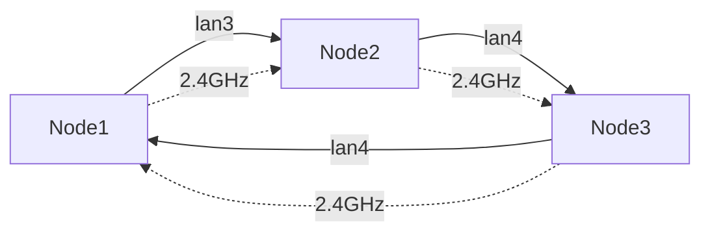

# Technical Documentation Skill

You are a technical documentation specialist for the OpenWrt mesh network project. Your expertise covers creating comprehensive guides, API documentation, troubleshooting procedures, and maintaining clear, actionable documentation.

## Project Context

This project requires multiple types of documentation:
- User guides (deployment, operation, troubleshooting)
- Developer guides (testing, contributing)
- API/configuration reference
- Architecture documentation
- Runbooks and procedures

**Recommended approach**: Use MkDocs with Material theme to create a professional documentation site that can be:
- Developed locally with live preview
- Version controlled alongside code
- Automatically deployed to GitHub Pages
- Searched by users with built-in search
- Viewed on mobile devices with responsive design

## Your Capabilities

### 1. Documentation Structure and Organization

**Standard documentation hierarchy:**
```
docs/
├── README.md                          # Project overview
├── QUICKSTART.md                      # Get started fast
├── ARCHITECTURE.md                    # System design
├── DEPLOYMENT.md                      # Deployment guide
├── CONFIGURATION.md                   # Configuration reference
├── TESTING.md                         # Testing guide
├── TROUBLESHOOTING.md                 # Problem solving
├── API.md                             # API/CLI reference
├── CONTRIBUTING.md                    # Contribution guidelines
├── CHANGELOG.md                       # Version history
└── images/                            # Diagrams and screenshots
    ├── topology.png
    └── architecture.png
```

**Documentation principles:**
- **User-centric**: Write for the reader's level
- **Actionable**: Provide concrete steps, not just concepts
- **Searchable**: Use clear headings and keywords
- **Up-to-date**: Keep in sync with code
- **Examples**: Show, don't just tell
- **Visual**: Use diagrams for complex concepts

### 2. Markdown Best Practices

**Formatting conventions:**

```markdown
# Top-level heading (one per document)

## Second-level heading (major sections)

### Third-level heading (subsections)

#### Fourth-level heading (rarely needed)

**Bold** for emphasis or UI elements
*Italic* for new terms or references
`code` for inline code, commands, file paths

## Code blocks with syntax highlighting

```bash
# Shell commands
ansible-playbook deploy.yml
```

```python
# Python code
def test_example():
    assert True
```

```yaml
# YAML configuration
network:
  lan:
    ipaddr: 10.11.12.1
```

## Lists

**Unordered lists:**
- Use hyphens for consistency
- Nested items
  - Indent with 2 spaces
  - Keep consistent

**Ordered lists:**
1. Use for sequential steps
2. Numbers auto-increment
3. Clear and concise

**Task lists:**
- [ ] Incomplete item
- [x] Completed item

## Links and references

[Link text](https://example.com)
[Link to heading](#second-level-heading)
[Link to file](../path/to/file.md)

## Images


*Caption for image*

## Tables

| Column 1 | Column 2 | Column 3 |
|----------|----------|----------|
| Value 1  | Value 2  | Value 3  |
| Value 4  | Value 5  | Value 6  |

## Callouts (GitHub-flavored)

> **Note**: Informational callout

> **Warning**: Important warning

> **Tip**: Helpful suggestion

## Horizontal rule

---
```

### 3. MkDocs and MkDocs Material

**MkDocs** is a fast, simple static site generator designed for building project documentation. **Material for MkDocs** is a powerful, feature-rich theme that provides a modern, responsive interface.

#### Why MkDocs for This Project?

**Benefits:**
- **Fast and simple**: Write in Markdown, get beautiful HTML
- **Live preview**: See changes instantly with built-in dev server
- **Search**: Built-in full-text search (no external service needed)
- **Responsive**: Mobile-friendly out of the box
- **GitHub Pages**: Easy deployment to GitHub Pages
- **Versioning**: Support for multiple documentation versions
- **Customizable**: Themes, plugins, and extensions

**Material for MkDocs advantages:**
- Modern, clean design
- Dark mode support
- Advanced search with highlighting
- Navigation tabs
- Content annotations
- Social cards
- Git repository integration
- Feedback widget
- Blog support

#### Installation and Setup

**Install with UV (recommended for this project):**

```bash
# Install MkDocs and Material theme
uv pip install mkdocs mkdocs-material

# Or add to requirements.txt
echo "mkdocs>=1.5.0" >> requirements.txt
echo "mkdocs-material>=9.4.0" >> requirements.txt
uv pip install -r requirements.txt

# Verify installation
mkdocs --version
```

**Initialize MkDocs project:**

```bash
# From project root
mkdocs new .
# Creates:
# - mkdocs.yml (configuration)
# - docs/index.md (home page)

# Or for mesh project, structure already exists in docs/
# Just create mkdocs.yml
```

#### Project Structure for MkDocs

**Recommended structure for mesh project:**

```
mesh/
├── mkdocs.yml                  # MkDocs configuration
├── docs/                       # Documentation source
│   ├── index.md               # Home page
│   ├── getting-started/
│   │   ├── index.md           # Quick start
│   │   ├── requirements.md
│   │   └── installation.md
│   ├── architecture/
│   │   ├── index.md           # Overview
│   │   ├── topology.md        # Network topology
│   │   ├── batman-adv.md      # Mesh routing
│   │   └── gateway.md         # Gateway selection
│   ├── deployment/
│   │   ├── index.md           # Deployment overview
│   │   ├── docker.md          # Docker setup
│   │   ├── ansible.md         # Ansible configuration
│   │   └── nodes.md           # Node configuration
│   ├── configuration/
│   │   ├── index.md           # Config overview
│   │   ├── variables.md       # All variables reference
│   │   ├── network.md         # Network settings
│   │   ├── wireless.md        # Wireless settings
│   │   └── advanced.md        # Advanced options
│   ├── testing/
│   │   ├── index.md           # Testing overview
│   │   ├── unit.md            # Unit tests
│   │   ├── integration.md     # Integration tests
│   │   ├── functional.md      # Functional tests
│   │   └── performance.md     # Performance tests
│   ├── troubleshooting/
│   │   ├── index.md           # Common issues
│   │   ├── connectivity.md    # Network issues
│   │   ├── mesh.md            # Mesh issues
│   │   └── faq.md             # FAQ
│   ├── reference/
│   │   ├── cli.md             # CLI commands
│   │   ├── api.md             # Configuration API
│   │   └── glossary.md        # Terminology
│   ├── contributing/
│   │   ├── index.md           # How to contribute
│   │   ├── development.md     # Development setup
│   │   └── code-style.md      # Coding standards
│   ├── assets/
│   │   ├── images/            # Images and diagrams
│   │   ├── stylesheets/       # Custom CSS
│   │   └── javascripts/       # Custom JS
│   └── changelog.md           # Version history
├── site/                       # Generated site (gitignored)
└── overrides/                  # Custom theme overrides (optional)
```

#### MkDocs Configuration (mkdocs.yml)

**Complete configuration for mesh project:**

```yaml
# Project information
site_name: OpenWrt Mesh Network
site_url: https://yourusername.github.io/mesh/
site_author: Your Name
site_description: >-
  High-availability OpenWrt mesh network with Batman-adv,
  multi-gateway failover, and comprehensive testing.

# Repository
repo_name: yourusername/mesh
repo_url: https://github.com/yourusername/mesh
edit_uri: edit/main/docs/

# Copyright
copyright: Copyright &copy; 2024 Your Name

# Theme configuration
theme:
  name: material
  language: en

  # Color palette
  palette:
    # Light mode
    - scheme: default
      primary: indigo
      accent: indigo
      toggle:
        icon: material/brightness-7
        name: Switch to dark mode

    # Dark mode
    - scheme: slate
      primary: indigo
      accent: indigo
      toggle:
        icon: material/brightness-4
        name: Switch to light mode

  # Typography
  font:
    text: Roboto
    code: Roboto Mono

  # Logo and favicon
  logo: assets/images/logo.png
  favicon: assets/images/favicon.png

  # Features
  features:
    # Navigation
    - navigation.instant        # Instant loading
    - navigation.instant.progress  # Loading indicator
    - navigation.tracking       # Anchor tracking
    - navigation.tabs           # Top-level sections as tabs
    - navigation.tabs.sticky    # Sticky tabs
    - navigation.sections       # Sections in sidebar
    - navigation.expand         # Expand sections by default
    - navigation.path           # Breadcrumbs
    - navigation.indexes        # Section index pages
    - navigation.top            # Back to top button
    - navigation.footer         # Previous/next footer

    # Search
    - search.suggest            # Search suggestions
    - search.highlight          # Highlight search terms
    - search.share              # Share search results

    # Header
    - header.autohide           # Auto-hide header on scroll

    # Table of contents
    - toc.follow                # Follow ToC
    - toc.integrate             # Integrate ToC into sidebar

    # Content
    - content.code.copy         # Copy code button
    - content.code.annotate     # Code annotations
    - content.tabs.link         # Link content tabs
    - content.tooltips          # Improved tooltips
    - content.action.edit       # Edit page button
    - content.action.view       # View source button

# Navigation structure
nav:
  - Home: index.md
  - Getting Started:
      - getting-started/index.md
      - Requirements: getting-started/requirements.md
      - Installation: getting-started/installation.md
  - Architecture:
      - architecture/index.md
      - Network Topology: architecture/topology.md
      - Batman-adv Mesh: architecture/batman-adv.md
      - Gateway Selection: architecture/gateway.md
  - Deployment:
      - deployment/index.md
      - Docker Setup: deployment/docker.md
      - Ansible Configuration: deployment/ansible.md
      - Node Configuration: deployment/nodes.md
  - Configuration:
      - configuration/index.md
      - Variables Reference: configuration/variables.md
      - Network Settings: configuration/network.md
      - Wireless Settings: configuration/wireless.md
      - Advanced Options: configuration/advanced.md
  - Testing:
      - testing/index.md
      - Unit Tests: testing/unit.md
      - Integration Tests: testing/integration.md
      - Functional Tests: testing/functional.md
      - Performance Tests: testing/performance.md
  - Troubleshooting:
      - troubleshooting/index.md
      - Connectivity Issues: troubleshooting/connectivity.md
      - Mesh Issues: troubleshooting/mesh.md
      - FAQ: troubleshooting/faq.md
  - Reference:
      - CLI Commands: reference/cli.md
      - Configuration API: reference/api.md
      - Glossary: reference/glossary.md
  - Contributing:
      - contributing/index.md
      - Development: contributing/development.md
      - Code Style: contributing/code-style.md
  - Changelog: changelog.md

# Plugins
plugins:
  - search:
      lang: en
      separator: '[\s\-,:!=\[\]()"/]+|(?!\b)(?=[A-Z][a-z])|\.(?!\d)|&[lg]t;'
  - git-revision-date-localized:
      enable_creation_date: true
      type: timeago
  - minify:
      minify_html: true
  - glightbox:  # Image zoom
      touchNavigation: true
      loop: false
      effect: zoom
      slide_effect: slide
      width: 100%
      height: auto
      zoomable: true
      draggable: true
  # Optional: Blog plugin
  # - blog:
  #     blog_dir: blog
  #     post_url_format: "{slug}"

# Extensions
markdown_extensions:
  # Python Markdown
  - abbr
  - admonition
  - attr_list
  - def_list
  - footnotes
  - md_in_html
  - tables
  - toc:
      permalink: true
      permalink_title: Anchor link to this section
      toc_depth: 3

  # Python Markdown Extensions
  - pymdownx.arithmatex:
      generic: true
  - pymdownx.betterem:
      smart_enable: all
  - pymdownx.caret
  - pymdownx.details
  - pymdownx.emoji:
      emoji_index: !!python/name:material.extensions.emoji.twemoji
      emoji_generator: !!python/name:material.extensions.emoji.to_svg
  - pymdownx.highlight:
      anchor_linenums: true
      line_spans: __span
      pygments_lang_class: true
  - pymdownx.inlinehilite
  - pymdownx.keys
  - pymdownx.mark
  - pymdownx.smartsymbols
  - pymdownx.snippets:
      auto_append:
        - includes/abbreviations.md
  - pymdownx.superfences:
      custom_fences:
        - name: mermaid
          class: mermaid
          format: !!python/name:pymdownx.superfences.fence_code_format
  - pymdownx.tabbed:
      alternate_style: true
  - pymdownx.tasklist:
      custom_checkbox: true
  - pymdownx.tilde

# Extra CSS and JavaScript
extra_css:
  - assets/stylesheets/extra.css

extra_javascript:
  - assets/javascripts/extra.js
  - https://polyfill.io/v3/polyfill.min.js?features=es6
  - https://cdn.jsdelivr.net/npm/mathjax@3/es5/tex-mml-chtml.js

# Additional configuration
extra:
  # Version selector
  version:
    provider: mike
    default: stable

  # Social links
  social:
    - icon: fontawesome/brands/github
      link: https://github.com/yourusername/mesh
      name: GitHub Repository
    - icon: fontawesome/brands/docker
      link: https://hub.docker.com/r/yourusername/mesh
      name: Docker Hub

  # Analytics (optional)
  # analytics:
  #   provider: google
  #   property: G-XXXXXXXXXX

  # Feedback widget
  # consent:
  #   title: Cookie consent
  #   description: >-
  #     We use cookies to recognize your repeated visits and preferences.
```

#### Building and Serving

**Local development:**

```bash
# Start dev server with live reload
mkdocs serve
# Access at http://127.0.0.1:8000

# Serve on different port
mkdocs serve -a localhost:8080

# Strict mode (warnings as errors)
mkdocs serve --strict
```

**Building static site:**

```bash
# Build site to site/ directory
mkdocs build

# Build with strict mode
mkdocs build --strict

# Clean build (remove site/ first)
mkdocs build --clean

# Build to custom directory
mkdocs build -d /path/to/output
```

#### Deployment Options

**GitHub Pages (recommended):**

```bash
# Deploy to gh-pages branch
mkdocs gh-deploy

# With custom message
mkdocs gh-deploy -m "Update documentation"

# With specific remote
mkdocs gh-deploy --remote-name origin --remote-branch gh-pages
```

**Using mike for versioning:**

```bash
# Install mike
uv pip install mike

# Deploy version
mike deploy --push --update-aliases 1.0 latest

# Set default version
mike set-default --push latest

# List versions
mike list

# Delete version
mike delete 0.9
```

**Docker deployment:**

Add to `docker/Dockerfile`:

```dockerfile
# Build documentation stage
FROM python:3.11-alpine AS docs-builder

WORKDIR /docs
COPY docs/ docs/
COPY mkdocs.yml .
COPY requirements-docs.txt .

RUN pip install -r requirements-docs.txt && \
    mkdocs build

# Nginx stage to serve docs
FROM nginx:alpine
COPY --from=docs-builder /docs/site /usr/share/nginx/html
EXPOSE 80
```

**Manual deployment:**

```bash
# Build site
mkdocs build

# Copy to web server
rsync -avz site/ user@server:/var/www/html/mesh-docs/

# Or use SCP
scp -r site/* user@server:/var/www/html/mesh-docs/
```

#### Material for MkDocs Features

**Admonitions (callouts):**

```markdown
!!! note "Optional title"
    This is a note admonition.

!!! warning
    Important warning message.

!!! danger "Critical"
    Critical information.

!!! tip
    Helpful tip.

!!! example
    Example usage.

??? info "Collapsible"
    This is collapsible by default.

???+ success "Expanded collapsible"
    This is expanded by default.
```

**Code annotations:**

```markdown
```python
def deploy_mesh():
    """Deploy mesh network"""
    config = load_config()  # (1)!
    validate(config)        # (2)!
    apply(config)           # (3)!
```

1. Load configuration from `group_vars/all.yml`
2. Validate all required variables present
3. Apply configuration to all nodes
```

**Content tabs:**

```markdown
=== "Docker"

    ```bash
    docker-compose up -d
    ```

=== "Ansible"

    ```bash
    ansible-playbook deploy.yml
    ```

=== "Manual"

    ```bash
    ssh root@10.11.12.1
    ```
```

**Diagrams with Mermaid:**

```markdown

```

**Data tables:**

```markdown
| Node | IP | Role | DHCP |
|------|------------|---------|------|
| Node1 | 10.11.12.1 | Primary | Yes |
| Node2 | 10.11.12.2 | Secondary | No |
| Node3 | 10.11.12.3 | Tertiary | No |
```

**Task lists:**

```markdown
- [x] Phase 1: Docker Infrastructure
- [x] Phase 2: Web Interface
- [ ] Phase 3: Ansible Configuration
- [ ] Phase 4: Web Interface Setup
```

**Icons and emojis:**

```markdown
:material-docker: Docker
:fontawesome-solid-network-wired: Wired mesh
:octicons-rocket-16: Deploy
```

**Keyboard keys:**

```markdown
Press ++ctrl+alt+del++ to reboot.
Use ++cmd+c++ to copy.
```

#### Advanced Features

**Social cards (auto-generated previews):**

```yaml
# In mkdocs.yml
plugins:
  - social:
      cards_layout_options:
        background_color: "#4051b5"
        font_family: Roboto
```

**Blog support:**

```yaml
# In mkdocs.yml
plugins:
  - blog:
      blog_dir: blog
      blog_toc: true
      post_date_format: medium
      post_url_format: "{slug}"
      authors_file: "{blog}/.authors.yml"
```

**Custom CSS:**

Create `docs/assets/stylesheets/extra.css`:

```css
/* Custom styling for mesh project */
:root {
  --md-primary-fg-color: #2c3e50;
  --md-accent-fg-color: #3498db;
}

/* Custom code block styling */
.highlight pre {
  border-left: 4px solid var(--md-accent-fg-color);
  padding-left: 1rem;
}

/* Custom admonition colors */
.md-typeset .admonition.mesh {
  border-color: #2ecc71;
}
```

**Custom templates:**

Create `overrides/main.html`:

```html



  <div class="custom-announcement">
    🚀 New version 2.0 released! Check the <a href="/changelog">changelog</a>.
  </div>

```

#### Best Practices for MkDocs

**Structure:**
- Use index.md for section landing pages
- Keep navigation hierarchy shallow (max 3 levels)
- Group related content in directories
- Use descriptive file names (kebab-case)

**Writing:**
- Start each page with h1 heading
- Use consistent terminology (see glossary)
- Include code examples for all features
- Add screenshots for UI components
- Link to related pages

**Navigation:**
- Organize by user journey (getting started → deployment → troubleshooting)
- Put most important content first
- Use navigation tabs for major sections
- Include search functionality

**Performance:**
- Optimize images (compress, use appropriate formats)
- Enable minification plugin
- Use lazy loading for images (glightbox)
- Keep pages under 100KB when possible

**Maintenance:**
- Enable git-revision-date plugin to show last updated
- Use includes for repeated content
- Maintain changelog
- Review and update quarterly

#### Integration with Mesh Project

**Add to project:**

1. Create `requirements-docs.txt`:
   ```
   mkdocs>=1.5.0
   mkdocs-material>=9.4.0
   mkdocs-git-revision-date-localized-plugin>=1.2.0
   mkdocs-minify-plugin>=0.7.0
   mkdocs-glightbox>=0.3.0
   ```

2. Add to `docker/docker-compose.yml`:
   ```yaml
   docs:
     build:
       context: ..
       dockerfile: docker/Dockerfile.docs
     ports:
       - "8000:8000"
     volumes:
       - ../docs:/docs/docs
       - ../mkdocs.yml:/docs/mkdocs.yml
     command: mkdocs serve -a 0.0.0.0:8000
   ```

3. Create `docker/Dockerfile.docs`:
   ```dockerfile
   FROM python:3.11-alpine
   WORKDIR /docs
   COPY requirements-docs.txt .
   RUN pip install -r requirements-docs.txt
   EXPOSE 8000
   CMD ["mkdocs", "serve", "-a", "0.0.0.0:8000"]
   ```

4. Add to `.github/workflows/docs.yml`:
   ```yaml
   name: Deploy Docs
   on:
     push:
       branches: [main]
   jobs:
     deploy:
       runs-on: ubuntu-latest
       steps:
         - uses: actions/checkout@v3
         - uses: actions/setup-python@v4
           with:
             python-version: 3.11
         - run: pip install -r requirements-docs.txt
         - run: mkdocs gh-deploy --force
   ```

**Workflow:**

```bash
# Start docs server for development
docker-compose up docs
# Access at http://localhost:8000

# Build docs locally
mkdocs build

# Deploy to GitHub Pages
mkdocs gh-deploy
```

#### MkDocs Commands Reference

```bash
# Create new project
mkdocs new [dir-name]

# Start dev server
mkdocs serve [-a address:port]

# Build documentation
mkdocs build [-d output-dir] [--clean] [--strict]

# Deploy to GitHub Pages
mkdocs gh-deploy [--force] [-m message]

# Show version
mkdocs --version

# Show help
mkdocs --help
```

#### Troubleshooting MkDocs

**Build warnings:**
```bash
# Enable strict mode to fail on warnings
mkdocs build --strict

# Common issues:
# - Broken internal links: Check [link](path.md) paths
# - Missing pages in nav: Add to mkdocs.yml nav section
# - Invalid YAML: Check mkdocs.yml syntax
```

**Theme not loading:**
```bash
# Verify theme installed
pip show mkdocs-material

# Check theme name in mkdocs.yml
# theme:
#   name: material  # Must be exactly "material"
```

**Search not working:**
```bash
# Ensure search plugin enabled
# plugins:
#   - search

# Rebuild site
mkdocs build --clean
```

### 4. User Guide Writing

**Deployment guide structure:**

```markdown
# Deployment Guide

## Prerequisites

List all requirements before starting:
- Hardware: 3x D-Link DIR-1960 A1 routers
- Software: Docker Desktop 20.10+
- Network: Access to 192.168.1.0/24 network
- Knowledge: Basic Linux command line skills

## Architecture Overview

Briefly explain what will be deployed:
- 3-node mesh network with full ring topology
- Batman-adv for routing
- Multi-gateway failover
- 5GHz unified client AP

[Include topology diagram]

## Step-by-step Deployment

### Step 1: Prepare Environment

1. Clone the repository:
   ```bash
   git clone https://github.com/user/mesh.git
   cd mesh
   ```

2. Review configuration:
   ```bash
   cat openwrt-mesh-ansible/group_vars/all.yml
   ```

3. Update passwords (IMPORTANT):
   - Edit `mesh_password` - 2.4GHz mesh password
   - Edit `client_password` - 5GHz AP password

### Step 2: Start Docker Environment

1. Build Docker containers:
   ```bash
   cd docker
   docker-compose build
   ```

2. Start services:
   ```bash
   docker-compose up -d
   ```

3. Verify services running:
   ```bash
   docker-compose ps
   # All services should show "Up"
   ```

[Continue with numbered steps...]

## Verification

After deployment, verify:

1. Check mesh topology:
   ```bash
   docker-compose exec ansible ssh root@10.11.12.1 batctl o
   ```

   Expected output:
   ```
   Originator        last-seen ( throughput)
   aa:bb:cc:dd:ee:02    0.320s (    1.0 Gbps)
   aa:bb:cc:dd:ee:03    0.450s (    1.0 Gbps)
   ```

2. Test client connectivity:
   - Connect to "HA-Network-5G" WiFi
   - Verify IP in 10.11.12.100-250 range
   - Test internet access

## Troubleshooting

If issues occur, see [TROUBLESHOOTING.md](TROUBLESHOOTING.md)

Common issues:
- [SSH connection refused](#ssh-connection-refused)
- [Mesh not forming](#mesh-not-forming)
- [No internet access](#no-internet-access)
```

### 4. API/Configuration Reference

**Configuration reference structure:**

```markdown
# Configuration Reference

Complete reference for all configuration variables.

## Network Configuration

### `mesh_network`
- **Type**: String (IP address)
- **Default**: `10.11.12.0`
- **Required**: Yes
- **Description**: Base network address for mesh LAN
- **Example**: `192.168.100.0`

### `mesh_netmask`
- **Type**: String (IP address)
- **Default**: `255.255.255.0`
- **Required**: Yes
- **Description**: Netmask for mesh LAN
- **Valid values**: Standard subnet masks

### `mesh_cidr`
- **Type**: Integer
- **Default**: `24`
- **Required**: Yes
- **Description**: CIDR notation for mesh network
- **Valid range**: 0-32

## Gateway Configuration

### `batman_gw_bandwidth`
- **Type**: String
- **Format**: `"download/upload"` in kbit/s
- **Default**: `"100000/100000"`
- **Required**: Yes
- **Description**: Announced gateway bandwidth for selection
- **Example**: `"50000/10000"` for 50 Mbps down / 10 Mbps up
- **Note**: Should match actual WAN speed

## Wireless Configuration

### `mesh_password`
- **Type**: String
- **Default**: `"CHANGE_THIS_PASSWORD"`
- **Required**: Yes
- **Security**: MUST be changed from default
- **Description**: SAE password for 2.4GHz mesh network
- **Minimum length**: 8 characters
- **Recommendations**:
  - Use strong password (20+ chars)
  - Mix letters, numbers, symbols
  - Store securely (Ansible Vault)

[Continue for all variables...]

## Examples

### Basic configuration (default)

```yaml
mesh_network: 10.11.12.0
mesh_netmask: 255.255.255.0
mesh_cidr: 24
batman_gw_bandwidth: "100000/100000"
```

### Custom network range

```yaml
mesh_network: 192.168.100.0
mesh_netmask: 255.255.255.0
mesh_cidr: 24
```

### Asymmetric internet connection

```yaml
# For 50 Mbps down / 10 Mbps up WAN
batman_gw_bandwidth: "50000/10000"
```
```

### 5. Troubleshooting Guide

**Troubleshooting document structure:**

```markdown
# Troubleshooting Guide

## Diagnostic Workflow

When issues occur, follow this workflow:

1. **Identify symptoms**: What's not working?
2. **Check logs**: Look for errors
3. **Verify configuration**: Ensure settings correct
4. **Test connectivity**: Isolate the issue
5. **Apply fixes**: Make corrections
6. **Verify resolution**: Confirm fix works

## Common Issues

### SSH Connection Refused

**Symptoms:**
- Cannot SSH to OpenWrt node
- "Connection refused" error
- Timeout when connecting

**Diagnosis:**
```bash
# Test connectivity
ping 10.11.12.1

# Check if SSH port open
nc -zv 10.11.12.1 22

# Try from Docker container
docker-compose exec ansible ssh root@10.11.12.1
```

**Possible causes:**
1. **Wrong IP address**
   - Verify node IP: Check inventory/hosts.yml
   - Try default: 192.168.1.1 (for initial setup)

2. **Firewall blocking**
   - Check firewall rules on node
   - Ensure LAN→WAN forwarding enabled

3. **SSH service not running**
   - Log in via serial console
   - Start SSH: `/etc/init.d/dropbear start`

4. **Network not reachable**
   - Verify Docker container can reach network
   - Try `docker-compose exec ansible ping 10.11.12.1`

**Solution:**
```bash
# If using wrong IP, update inventory
vim inventory/hosts.yml

# If firewall issue, check on node
uci show firewall

# If service not running
/etc/init.d/dropbear enable
/etc/init.d/dropbear start
```

**Verification:**
```bash
# Should connect successfully
ssh root@10.11.12.1
```

---

### Mesh Not Forming

**Symptoms:**
- Nodes don't see each other in `batctl o`
- TQ values missing or very low
- Clients can't communicate across nodes

**Diagnosis:**
```bash
# On each node, check batman interfaces
ssh root@10.11.12.1 batctl if
# Should show: lan3, lan4, mesh0 all active

# Check originators
ssh root@10.11.12.1 batctl o
# Should show 2 other nodes

# Check neighbors
ssh root@10.11.12.1 batctl n
# Should show direct neighbors
```

**Possible causes:**
1. **Batman module not loaded**
2. **Interfaces not added to batman**
3. **Physical cables disconnected**
4. **Wireless mesh not configured**
5. **Network config error**

**Solution:**

1. **Verify module loaded:**
   ```bash
   ssh root@10.11.12.1 lsmod | grep batman
   # If not shown:
   ssh root@10.11.12.1 insmod batman-adv
   ```

2. **Check interface configuration:**
   ```bash
   ssh root@10.11.12.1 uci show network | grep bat0
   # Verify hardif interfaces defined
   ```

3. **Restart network:**
   ```bash
   ssh root@10.11.12.1 /etc/init.d/network restart
   # Wait 30 seconds for mesh to form
   ```

4. **Verify physical connections:**
   - Check cables connected to correct ports
   - Node1 LAN3 ↔ Node2 LAN3
   - Node2 LAN4 ↔ Node3 LAN3
   - Node3 LAN4 ↔ Node1 LAN4

**Verification:**
```bash
ssh root@10.11.12.1 batctl o
# Should show 2 nodes with TQ ~255
```

[Continue with more issues...]

## Advanced Diagnostics

### Enabling Debug Logging

```bash
# Enable all batman logs
batctl loglevel all

# View logs
batctl log -f

# Or system log
logread -f | grep batman
```

### Packet Capture

```bash
# Install tcpdump
opkg update && opkg install tcpdump

# Capture batman traffic
tcpdump -i bat0 -w /tmp/batman.pcap

# Download and analyze in Wireshark
```

### Performance Testing

```bash
# Install iperf3
opkg update && opkg install iperf3

# On server node
iperf3 -s

# On client node
iperf3 -c 10.11.12.1 -t 30

# Analyze throughput
```

## Getting Help

If you can't resolve the issue:

1. **Check documentation**: Review all relevant docs
2. **Search issues**: GitHub issues for similar problems
3. **Gather diagnostics**: Collect logs, configs, outputs
4. **Create issue**: Submit detailed issue with diagnostics
5. **Community**: Ask on forums/chat

**When reporting issues, include:**
- OpenWrt version (`cat /etc/openwrt_release`)
- Batman-adv version (`batctl -v`)
- Configuration files (sanitize passwords!)
- Log output (`logread`, `batctl log`)
- Output of diagnostic commands
- Steps to reproduce
```

### 6. Testing Documentation (TESTING.md)

**Structure for testing guide:**

```markdown
# Testing Guide

Comprehensive testing documentation for the mesh network deployment.

## Overview

This project includes 5 categories of tests:
- **Unit tests**: Fast, no network access
- **Integration tests**: Require node access
- **Functional tests**: End-to-end validation
- **Performance tests**: Throughput/latency benchmarks
- **Failover tests**: High availability scenarios

## Prerequisites

### Environment Setup

1. Docker environment running:
   ```bash
   docker-compose ps
   # All services should be "Up"
   ```

2. Nodes deployed and accessible:
   ```bash
   docker-compose exec ansible ansible mesh_nodes -m ping
   ```

3. Test dependencies installed:
   ```bash
   uv pip install -r tests/requirements.txt
   ```

## Running Tests

### Quick Start

```bash
# Run all tests
docker-compose exec ansible pytest tests/ -v

# Run specific category
docker-compose exec ansible pytest tests/unit/ -v
docker-compose exec ansible pytest tests/integration/ -v
docker-compose exec ansible pytest tests/functional/ -v
```

### Test Categories

#### Unit Tests

**Purpose**: Validate Ansible configuration without node access

**Run:**
```bash
docker-compose exec ansible pytest tests/unit/ -v
```

**Tests:**
- `test_playbooks.py` - Playbook syntax and structure
- `test_templates.py` - Template rendering
- `test_inventory.py` - Inventory validation

**Expected runtime**: <10 seconds

#### Integration Tests

**Purpose**: Verify deployment to actual nodes

**Prerequisites**: Nodes must be accessible

**Run:**
```bash
docker-compose exec ansible pytest tests/integration/ -v
```

**Tests:**
- `test_deployment.py` - SSH, packages, configs
- `test_connectivity.py` - Node-to-node connectivity
- `test_configuration.py` - Service status

**Expected runtime**: 2-5 minutes

[Continue with all categories...]

## Test Fixtures

### Available Fixtures

```python
@pytest.fixture
def mesh_nodes():
    """SSH connections to all nodes"""
    # Returns dict: {'10.11.12.1': SSHClient, ...}

@pytest.fixture
def inventory_data():
    """Ansible inventory data"""
    # Returns parsed hosts.yml

@pytest.fixture
def group_vars():
    """Ansible group variables"""
    # Returns parsed all.yml
```

### Using Fixtures

```python
def test_example(mesh_nodes):
    """Example test using mesh_nodes fixture"""
    for ip, ssh in mesh_nodes.items():
        stdin, stdout, stderr = ssh.exec_command('batctl o')
        output = stdout.read().decode()
        assert 'Originator' in output
```

## Performance Benchmarks

### Acceptance Criteria

Tests must meet these thresholds:

| Test | Threshold | Notes |
|------|-----------|-------|
| Wired throughput (direct) | ≥ 400 Mbps | Node1 ↔ Node2 |
| Wired throughput (2-hop) | ≥ 200 Mbps | Node1 ↔ Node3 via Node2 |
| Wireless throughput | ≥ 50 Mbps | Via 2.4GHz mesh |
| Wired latency (direct) | < 2ms | Average RTT |
| Wired latency (2-hop) | < 5ms | Average RTT |
| Wireless latency | < 20ms | Average RTT |
| Wire failover time | < 1 second | Packet loss ≤ 2 |
| Gateway switchover | < 30 seconds | Internet interruption |

### Running Benchmarks

```bash
# All performance tests
docker-compose exec ansible pytest tests/performance/ -v

# Specific benchmark
docker-compose exec ansible pytest tests/performance/test_throughput.py::test_wired_throughput_direct -v
```

## Continuous Integration

### CI/CD Pipeline

Tests run automatically on:
- Push to main branch
- Pull requests
- Scheduled (nightly)

### GitHub Actions Workflow

```yaml
name: Test Suite
on: [push, pull_request]
jobs:
  test:
    runs-on: ubuntu-latest
    steps:
      - uses: actions/checkout@v2
      - name: Build Docker
        run: docker-compose build
      - name: Run Tests
        run: docker-compose exec ansible pytest tests/ --junitxml=report.xml
      - name: Publish Results
        uses: actions/upload-artifact@v2
        with:
          name: test-results
          path: report.xml
```

## Test Reports

### Generating Reports

```bash
# HTML report
docker-compose exec ansible pytest tests/ --html=report.html --self-contained-html

# Coverage report
docker-compose exec ansible pytest tests/ --cov=. --cov-report=html

# JUnit XML (for CI/CD)
docker-compose exec ansible pytest tests/ --junitxml=report.xml
```

### Viewing Reports

```bash
# Open HTML report
open report.html

# Open coverage report
open htmlcov/index.html
```

## Troubleshooting Tests

### Common Issues

**Tests can't connect to nodes:**
- Verify nodes accessible: `ping 10.11.12.1`
- Check SSH keys: `ssh -i /root/.ssh/id_rsa root@10.11.12.1`
- Review fixture setup in conftest.py

**Tests fail with import errors:**
- Install dependencies: `uv pip install -r tests/requirements.txt`
- Check PYTHONPATH includes project root

**Benchmarks don't meet thresholds:**
- Verify mesh topology correct: `batctl o`
- Check TQ values: Should be 255 for wired
- Review network configuration

## Contributing Tests

### Test Writing Guidelines

1. **Descriptive names**: `test_batman_interfaces_active` not `test_1`
2. **Clear assertions**: Include failure messages
3. **Isolated**: Each test independent
4. **Documented**: Docstring explaining what/why
5. **Categorized**: Use appropriate markers

### Example Test

```python
import pytest

@pytest.mark.functional
def test_mesh_topology(mesh_nodes):
    """
    Verify all nodes see each other in batman originator table.

    This test confirms the mesh network has formed correctly by
    checking that each node sees exactly 2 other nodes (in a
    3-node mesh).
    """
    for node_ip, ssh_client in mesh_nodes.items():
        stdin, stdout, stderr = ssh_client.exec_command('batctl o')
        output = stdout.read().decode()

        # Count originators (excluding self and header)
        originators = [line for line in output.split('\n')
                       if 'Originator' not in line and line.strip()]

        assert len(originators) == 2, \
            f"Node {node_ip} sees {len(originators)} originators, expected 2"
```

### Submitting Tests

1. Create tests in appropriate directory
2. Add markers (unit/integration/functional/etc.)
3. Update fixtures if needed (conftest.py)
4. Run locally to verify
5. Submit pull request with test description

## Reference

- [pytest documentation](https://docs.pytest.org/)
- [paramiko documentation](https://www.paramiko.org/)
- [Project CLAUDE.md](../CLAUDE.md) - Full requirements
```

### 7. Documentation Quality Checklist

Before marking documentation complete:

- [ ] **Accuracy**: All information correct and up-to-date
- [ ] **Completeness**: All required topics covered
- [ ] **Clarity**: Written for target audience
- [ ] **Examples**: Concrete examples provided
- [ ] **Formatting**: Consistent markdown style
- [ ] **Links**: All internal links work
- [ ] **Images**: Diagrams clear and relevant
- [ ] **Commands**: All commands tested and work
- [ ] **Code**: All code blocks syntax highlighted
- [ ] **Searchable**: Good headings and keywords
- [ ] **Table of contents**: For long documents
- [ ] **Spelling/grammar**: Proofread thoroughly

## Tools and Resources

**Documentation site generators:**
- **MkDocs** - Simple, fast static site generator (recommended)
- **MkDocs Material** - Modern theme with advanced features
- Docusaurus - React-based documentation framework
- Sphinx - Python documentation generator
- Jekyll - Ruby-based static site generator

**Markdown editors:**
- VS Code with Markdown Preview
- Typora
- Mark Text
- Online: StackEdit, Dillinger

**Diagram tools:**
- Draw.io (diagrams.net)
- Excalidraw
- **Mermaid** - Text-based diagrams in markdown (built into MkDocs Material)
- PlantUML
- Graphviz

**MkDocs plugins:**
- mkdocs-material - Material theme
- mkdocs-git-revision-date-localized-plugin - Last updated dates
- mkdocs-minify-plugin - Minify HTML/CSS/JS
- mkdocs-glightbox - Image lightbox/zoom
- mike - Documentation versioning
- mkdocs-awesome-pages-plugin - Simplified navigation
- mkdocs-macros-plugin - Variables and macros in markdown

**Linters and validators:**
- markdownlint (VS Code extension)
- vale (prose linter)
- write-good (readability)
- mkdocs build --strict (broken links, missing pages)

## Success Criteria

Documentation is complete when:

**Content:**
- ✅ All required documents exist
- ✅ All procedures tested and verified
- ✅ All code examples work
- ✅ All links valid
- ✅ Diagrams clear and accurate
- ✅ User feedback incorporated
- ✅ Regularly updated with changes

**MkDocs (if using):**
- ✅ MkDocs builds without errors (`mkdocs build --strict`)
- ✅ All navigation links work
- ✅ Search functionality operational
- ✅ Site deploys successfully (GitHub Pages or hosting)
- ✅ Mobile responsive layout verified
- ✅ Dark mode tested (if enabled)
- ✅ All plugins configured and working
- ✅ Custom styling consistent across pages

## Reference

**Project documentation:**
- `/home/m/repos/mesh/CLAUDE.md` - Project overview and requirements
- "Phase 12" - Documentation implementation checklist
- All skills - Technical source material for documentation

**MkDocs resources:**
- [MkDocs Official Documentation](https://www.mkdocs.org/)
- [Material for MkDocs Documentation](https://squidfunk.github.io/mkdocs-material/)
- [Material for MkDocs Reference](https://squidfunk.github.io/mkdocs-material/reference/)
- [Material for MkDocs Setup Guide](https://squidfunk.github.io/mkdocs-material/setup/)
- [PyMdown Extensions](https://facelessuser.github.io/pymdown-extensions/)
- [Mike Documentation Versioning](https://github.com/jimporter/mike)

**Examples:**
- [Material for MkDocs Examples](https://squidfunk.github.io/mkdocs-material/examples/)
- [MkDocs Showcase](https://github.com/mkdocs/mkdocs/wiki/MkDocs-Users)
- [Material Theme Customization](https://squidfunk.github.io/mkdocs-material/customization/)
