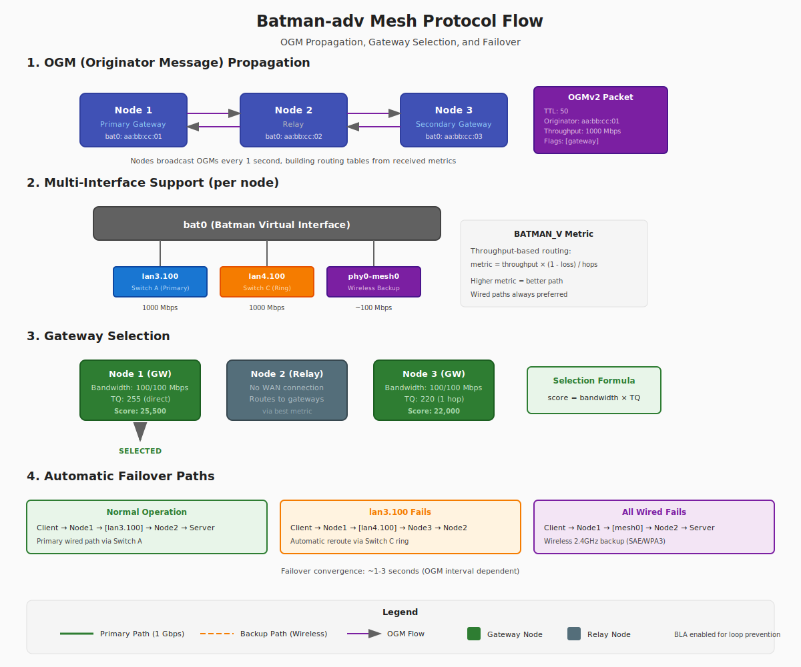
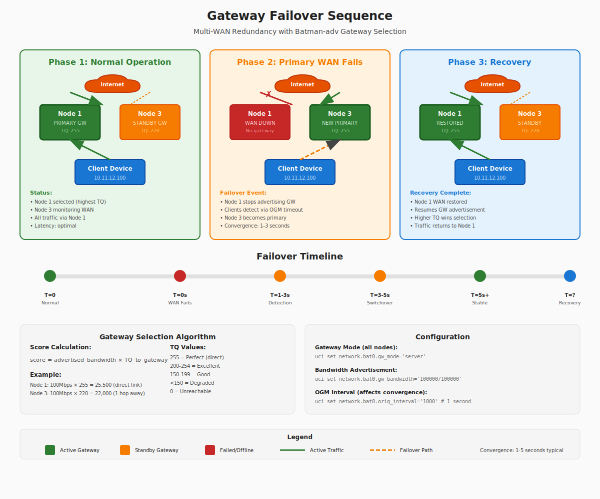

# Batman-adv Mesh Protocol

This document provides a deep dive into how batman-adv (Better Approach To Mobile Adhoc Networking - advanced) works and how it's configured in this mesh network.



*Batman-adv mesh operation showing OGM propagation, multi-interface support, translation tables, and gateway selection.*

## What is Batman-adv?

Batman-adv is a Layer 2 mesh routing protocol that operates at the Ethernet level. It creates a virtual network interface (`bat0`) that acts as a switch connecting all nodes in the mesh.

```
┌────────────────────────────────────────────────────────────────────┐
│                        Batman-adv Mesh                              │
│                                                                     │
│   ┌─────────┐         ┌─────────┐         ┌─────────┐              │
│   │  Node1  │◄───────►│  Node2  │◄───────►│  Node3  │              │
│   │  bat0   │         │  bat0   │         │  bat0   │              │
│   └────┬────┘         └────┬────┘         └────┬────┘              │
│        │                   │                   │                    │
│   ┌────┴────┐         ┌────┴────┐         ┌────┴────┐              │
│   │ br-lan  │         │ br-lan  │         │ br-lan  │              │
│   └────┬────┘         └────┬────┘         └────┬────┘              │
│        │                   │                   │                    │
│   Clients here        Clients here        Clients here             │
│   see ALL other       see ALL other       see ALL other            │
│   clients             clients             clients                   │
└────────────────────────────────────────────────────────────────────┘
```

## Layer 2 vs Layer 3

### Why Layer 2?

| Aspect | Layer 2 (Batman-adv) | Layer 3 (OLSR, Babel) |
|--------|---------------------|----------------------|
| **Protocol agnostic** | Yes - IPv4, IPv6, ARP all work | IP only |
| **VLAN support** | Native | Complex |
| **DHCP** | Works anywhere | Chicken-and-egg problem |
| **Bridge integration** | Seamless | Requires routing |
| **Complexity** | Lower | Higher |

### How Layer 2 Works

Batman-adv doesn't route IP packets - it switches Ethernet frames:

```
┌─────────────────────────────────────────────────────────────────┐
│                    Layer 2 Frame                                 │
├─────────────────────────────────────────────────────────────────┤
│ Destination MAC │ Source MAC │ Type │    Payload    │ CRC      │
│ aa:bb:cc:dd:ee  │ 11:22:33:44│ 0800 │ IP packet...  │ xxxxxx   │
└─────────────────────────────────────────────────────────────────┘
                              ↓
┌─────────────────────────────────────────────────────────────────┐
│              Batman-adv Encapsulation                            │
├─────────────────────────────────────────────────────────────────┤
│ Batman Header │ Original Frame (unchanged)                      │
│ (routing info)│ Destination MAC │ Source MAC │ Payload │ ...   │
└─────────────────────────────────────────────────────────────────┘
```

## BATMAN_V Algorithm

This network uses BATMAN_V (the current generation algorithm). Here's how it works:

### Throughput-Based Routing

BATMAN_V measures **actual throughput** between nodes:

```
Node1 ─────[1000 Mbps]───── Node2
  │                           │
  └────[100 Mbps]─────────────┘
       (wireless backup)
```

BATMAN_V will always choose the 1000 Mbps path, even if the wireless link has fewer hops.

### Metric Calculation

The BATMAN_V metric combines:

1. **Throughput**: Measured via echo/response packets (ELP - Echo Location Protocol)
2. **Packet loss**: Detected via missing responses
3. **Hop count**: Each hop adds overhead

```python
# Simplified metric calculation
metric = throughput * (1 - packet_loss) / hop_count
```

### OGM (Originator Message) Protocol

Nodes announce themselves via OGM packets:

```
┌────────────────────────────────────────┐
│           OGM v2 Packet                │
├────────────────────────────────────────┤
│ Version: 2                             │
│ TTL: 50                                │
│ Flags: [gateway, direct link]          │
│ Sequence: 12345                        │
│ Originator: aa:bb:cc:dd:ee:01          │
│ Throughput: 1000 Mbps                  │
│ Previous Sender: aa:bb:cc:dd:ee:02     │
└────────────────────────────────────────┘
```

Every node:

1. Broadcasts OGMs periodically (1 second default)
2. Re-broadcasts received OGMs (with modified metrics)
3. Builds routing table from received OGMs

## Multi-Interface Support

Batman-adv can use multiple physical interfaces simultaneously:

```
bat0 (Batman virtual interface)
 │
 ├── lan3.100 (Wired to Switch A)     Primary path
 │
 ├── lan4.100 (Wired to Switch B)     Primary path (ring)
 │
 └── mesh0   (802.11s Wireless)       Backup path
```

### Automatic Failover

If one interface fails, traffic automatically routes through others:

```
Normal operation:
  Client → Node1 → [lan3.100] → Node2 → Server

lan3.100 fails:
  Client → Node1 → [lan4.100] → Node3 → [lan3.100] → Node2 → Server

Both wired links fail:
  Client → Node1 → [mesh0 wireless] → Node2 → Server
```

## Gateway Selection



*Automatic gateway failover: when Node1's WAN fails, clients automatically switch to Node3.*

Batman-adv has built-in gateway selection for internet access.

### Gateway Modes

| Mode | Description |
|------|-------------|
| `server` | This node offers internet access |
| `client` | This node uses another gateway |
| `off` | Gateway selection disabled |

### Our Configuration

All nodes run as gateway servers (multi-gateway setup):

```bash
# On each node
batctl gw_mode
# Output: server
```

### How Clients Choose Gateways

1. Gateways advertise their bandwidth via OGMs
2. Clients measure TQ (transmission quality) to each gateway
3. Selection formula: `score = bandwidth * TQ`

```
Gateway Selection Example:

Gateway    Bandwidth    TQ     Score
Node1      100/100      255    25500  ← Selected
Node2      100/100      220    22000
Node3      100/100      180    18000
```

### Gateway Bandwidth Configuration

```bash
# In UCI configuration
uci set network.bat0.gw_bandwidth='100000/100000'
# Format: download/upload in Kbit/s
```

## Translation Tables

Batman-adv maintains tables mapping clients to nodes:

### Local Translation Table

Shows clients directly connected to this node:

```bash
batctl tl
# Output:
# Client              VID   Flags    Last seen
# aa:bb:cc:dd:ee:ff   -1    [.P....]    0.320s
```

### Global Translation Table

Shows all clients across the entire mesh:

```bash
batctl tg
# Output:
# Client              VID   Flags  Origin         Last ttvn   TQ
# aa:bb:cc:dd:ee:ff   -1    [RP..]  node1-mac     12          255
```

## Configuration in This Network

### UCI Configuration

```bash
# /etc/config/network (relevant sections)

config interface 'bat0'
    option proto 'batadv'
    option routing_algo 'BATMAN_V'
    option gw_mode 'server'
    option gw_bandwidth '100000/100000'
    option hop_penalty '15'
    option orig_interval '1000'
    option fragmentation '1'

config interface 'mesh_lan3'
    option proto 'batadv_hardif'
    option master 'bat0'
    option device 'lan3.100'

config interface 'mesh_lan4'
    option proto 'batadv_hardif'
    option master 'bat0'
    option device 'lan4.100'

config interface 'mesh_wlan'
    option proto 'batadv_hardif'
    option master 'bat0'
    option device 'mesh0'
```

### Key Parameters

| Parameter | Value | Description |
|-----------|-------|-------------|
| `routing_algo` | BATMAN_V | Throughput-based routing |
| `gw_mode` | server | All nodes are gateways |
| `gw_bandwidth` | 100000/100000 | 100 Mbps up/down |
| `hop_penalty` | 15 | Penalty per hop (0-255) |
| `orig_interval` | 1000 | OGM broadcast interval (ms) |
| `fragmentation` | 1 | Enable MTU fragmentation |

## VLAN Support

Batman-adv supports VLANs over the mesh:

```
┌───────────────────────────────────────────────────────────────┐
│                    bat0 (mesh)                                 │
│  ┌──────────┐  ┌──────────┐  ┌──────────┐                     │
│  │ VLAN 10  │  │ VLAN 20  │  │ VLAN 30  │                     │
│  │  (mgmt)  │  │ (guest)  │  │  (IoT)   │                     │
│  └──────────┘  └──────────┘  └──────────┘                     │
└───────────────────────────────────────────────────────────────┘
```

### VLAN Configuration

```bash
# Check VLAN status
batctl vlan

# VLAN isolation (e.g., for guest network VLAN 20)
batctl vlan -p 20 ap_isolation 1
```

## Performance Tuning

### For Low-Latency

```bash
# Faster OGM updates
uci set network.bat0.orig_interval='500'

# Lower hop penalty (prefer shortest path)
uci set network.bat0.hop_penalty='10'
```

### For Stability

```bash
# Slower OGM updates (less overhead)
uci set network.bat0.orig_interval='2000'

# Higher hop penalty (prefer direct links)
uci set network.bat0.hop_penalty='30'
```

### For Wireless-Heavy Networks

```bash
# Enable bonding mode
uci set network.bat0.bonding='1'

# Enable fragmentation
uci set network.bat0.fragmentation='1'
```

## Debugging Commands

### Essential Commands

```bash
# View all originators (routing table)
batctl o

# View direct neighbors
batctl n

# View interfaces
batctl if

# View gateways
batctl gwl

# Ping through mesh (Layer 2)
batctl ping <MAC-address>

# Traceroute through mesh
batctl traceroute <MAC-address>
```

### Statistics

```bash
# General statistics
batctl s

# Interface statistics
batctl ti

# Gateway mode
batctl gw
```

### Troubleshooting

```bash
# Check batman module is loaded
lsmod | grep batman

# Check batman version
batctl -v

# View detailed originator info
batctl o -H

# Monitor OGM reception
batctl o -w
```

## Common Issues

### No Originators Visible

**Symptoms**: `batctl o` shows no entries

**Causes**:

1. No interfaces attached to batman
2. Physical connectivity issue
3. VLAN mismatch
4. MTU problems

**Debug**:

```bash
batctl if
# Should show: lan3.100: active, lan4.100: active, mesh0: active

# If interfaces missing, check:
ip link show | grep -E "(lan3|lan4|mesh)"
```

### Flapping Routes

**Symptoms**: TQ values fluctuate rapidly

**Causes**:

1. Wireless interference
2. Loose cables
3. Overloaded links

**Debug**:

```bash
# Watch TQ changes
watch -n 1 'batctl o'

# Check for errors
ip -s link show lan3.100
```

### Gateway Not Selected

**Symptoms**: No default gateway, can't reach internet

**Debug**:

```bash
# Check gateway mode
batctl gw

# Check gateway list
batctl gwl

# If empty, verify WAN is up on gateway nodes
ip route show default
```

## Further Reading

- [Batman-adv Wiki](https://www.open-mesh.org/projects/batman-adv/wiki)
- [BATMAN_V Documentation](https://www.open-mesh.org/projects/batman-adv/wiki/BATMAN_V)
- [batctl Manual](https://downloads.open-mesh.org/batman/manpages/batctl.8.html)
