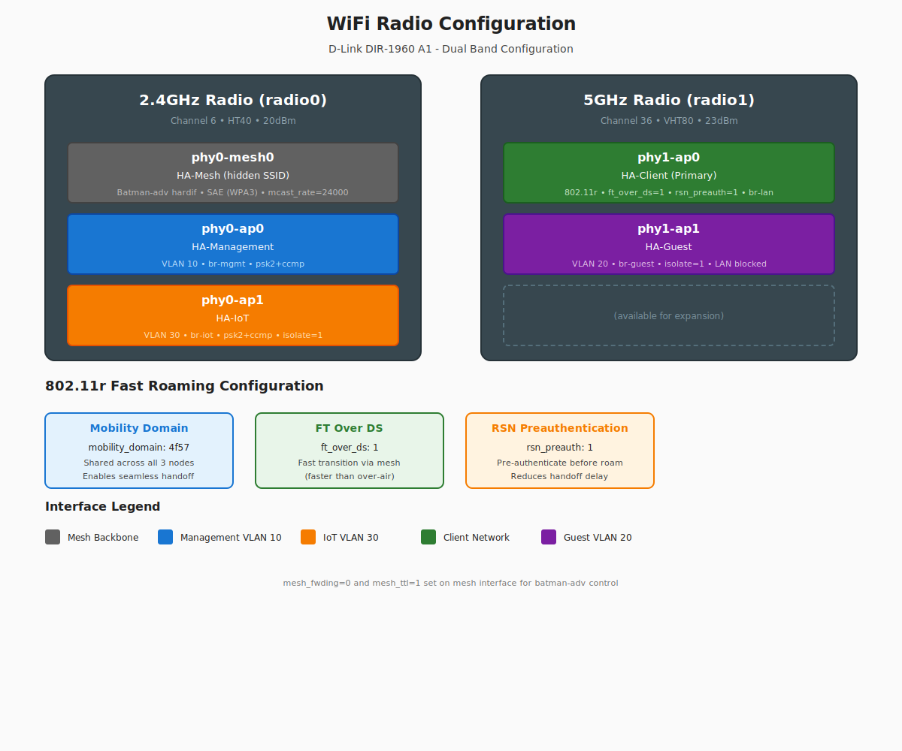

# Multi-Network VLAN Architecture

## Overview


*VLAN architecture showing network segments, bridges, and traffic flow through the mesh.*

This mesh network now supports **multiple isolated networks** using VLANs and dual-SSID wireless configuration:

- **2.4GHz Radio**: Mesh backhaul + Management AP
- **5GHz Radio**: Internal/Trusted AP + Guest AP (isolated)
- **VLANs**: Network segmentation for security and management

## Network Architecture

### Network Segments

| Network | VLAN ID | Subnet | Wireless | Wired | Purpose | Isolation |
|---------|---------|---------|----------|-------|---------|-----------|
| **Client (Main LAN)** | 200 | 10.11.12.0/24 | 5GHz (HA-Client) | LAN1, lan3.200 | Trusted internal devices | No |
| **Management** | 10 | 10.11.10.0/24 | 2.4GHz (HA-Management) | lan3.10 | Admin/switch access | No (can access LAN) |
| **Guest** | 20 | 10.11.20.0/24 | 5GHz (HA-Guest) | bat0.20 only | Guest WiFi | Yes (isolated) |
| **IoT** | 30 | 10.11.30.0/24 | 2.4GHz (HA-IoT) | LAN2, lan3.30 | Smart home devices | Yes (limited access) |
| **Mesh Backbone** | 100 | - | 2.4GHz (HA-Mesh) | lan3.100, lan4.100 | Batman-adv backbone | N/A |

### Wireless Configuration



*Dual-radio wireless configuration showing SSIDs, VLANs, and network bridging.*

#### 2.4GHz Radio (radio0) - Triple Purpose

```
┌─────────────────────────────────┐
│        2.4GHz Radio (radio0)     │
├─────────────────────────────────┤
│ mesh0:  Batman-adv mesh backup   │  ← Mesh backhaul
│ mgmt0:  Management AP (VLAN 10)  │  ← Admin access
│ iot0:   IoT AP (VLAN 30)         │  ← IoT devices
└─────────────────────────────────┘
```

**SSIDs:**

- **Mesh**: `HA-Mesh` (hidden, mesh protocol)
- **Management**: `HA-Management` (VLAN 10)
- **IoT**: `HA-IoT` (VLAN 30, isolated)

#### 5GHz Radio (radio1) - Dual SSID

```
┌─────────────────────────────────┐
│        5GHz Radio (radio1)       │
├─────────────────────────────────┤
│ wlan0:  Internal AP (Main LAN)   │  ← Trusted devices
│ guest0: Guest AP (VLAN 20)       │  ← Isolated guests
└─────────────────────────────────┘
```

**SSIDs:**

- **Internal**: `HA-Client` (Main LAN, 802.11r roaming)
- **Guest**: `HA-Guest` (VLAN 20, isolated)

## IP Address Allocation

### Main LAN (10.11.12.0/24)

```
10.11.12.1      - Node 1 (Gateway + DHCP + DNS)
10.11.12.2      - Node 2 (Gateway + DHCP + DNS)
10.11.12.3      - Node 3 (Gateway + DHCP + DNS)
10.11.12.10-99  - Reserved for static IPs
10.11.12.100-149 - DHCP pool (Node1 serves)
10.11.12.150-199 - DHCP pool (Node2 serves)
10.11.12.200-249 - DHCP pool (Node3 serves)
```

### Management VLAN 10 (10.11.10.0/24)

```
10.11.10.1      - Node 1 (VLAN interface)
10.11.10.2      - Node 2 (VLAN interface)
10.11.10.3      - Node 3 (VLAN interface)
10.11.10.100-149 - DHCP pool (all nodes serve)
```

### Guest VLAN 20 (10.11.20.0/24)

```
10.11.20.1      - Node 1 (VLAN interface)
10.11.20.2      - Node 2 (VLAN interface)
10.11.20.3      - Node 3 (VLAN interface)
10.11.20.100-149 - DHCP pool (all nodes serve)
```

## Firewall Rules

### Main LAN Zone

- **Input**: ACCEPT
- **Output**: ACCEPT
- **Forward**: ACCEPT
- **→ WAN**: Allowed (NAT/masquerade)

### Management VLAN Zone

- **Input**: ACCEPT (can access router services)
- **Output**: ACCEPT
- **Forward**: REJECT (default)
- **→ WAN**: Allowed (internet access)
- **→ LAN**: Allowed (can manage main network)

### Guest VLAN Zone (Isolated)

- **Input**: REJECT (cannot access router except DHCP/DNS)
- **Output**: ACCEPT
- **Forward**: REJECT (default)
- **→ WAN**: Allowed (internet only)
- **→ LAN**: **BLOCKED** (cannot access internal network)

## Use Cases

### Management Network (2.4GHz)

**Purpose**: Administrator access to mesh infrastructure

**Use cases:**

- IT admin laptops
- Network management tools
- Troubleshooting access
- Can access both LAN devices and WAN

**Security**: Trusted, can access main LAN

### Internal Network (5GHz - Main LAN)

**Purpose**: Primary trusted network for internal devices

**Use cases:**

- Employee workstations
- Internal servers
- Smart home devices
- Full LAN and WAN access

**Features**: 802.11r fast roaming between nodes

### Guest Network (5GHz - VLAN 20)

**Purpose**: Internet-only access for visitors/untrusted devices

**Use cases:**

- Visitor devices
- Contractor laptops
- IoT devices that only need internet
- Untrusted devices

**Security**: Isolated from LAN, internet-only

## Configuration

### Required Changes to `group_vars/all.yml`

The following configuration is already applied:

```yaml
# Enable VLAN support
enable_vlans: true

# VLAN Definitions
vlans:
  management:
    vid: 10
    network: 10.11.10.0/24
    dhcp_start: 100
    dhcp_limit: 50
    ssid: HA-Management
    password: YourMgmtPassword123!  # CHANGE THIS!
    encryption: psk2+ccmp

  guest:
    vid: 20
    network: 10.11.20.0/24
    dhcp_start: 100
    dhcp_limit: 50
    isolation: true  # Blocks LAN access
    ssid: HA-Guest
    password: YourGuestPassword123!  # CHANGE THIS!
    encryption: psk2+ccmp
```

### Deployment

```bash
# Deploy configuration to all nodes
cd openwrt-mesh-ansible
ansible-playbook -i inventory/hosts.yml playbooks/deploy.yml

# Verify VLAN interfaces
ansible mesh_nodes -a "ip addr show" -i inventory/hosts.yml

# Check wireless interfaces
ansible mesh_nodes -a "iw dev" -i inventory/hosts.yml
```

## Client Connection Guide

### Connecting to Management Network

1. Scan for WiFi: `HA-Management` (2.4GHz)
2. Connect with management password
3. Receive IP: 10.11.10.x
4. DNS: 10.11.10.1, 10.11.10.2, 10.11.10.3
5. Gateway: Automatic via DHCP
6. **Access**: Full LAN + WAN access

### Connecting to Internal Network

1. Scan for WiFi: `HA-Client` (5GHz)
2. Connect with internal password
3. Receive IP: 10.11.12.x (from one of the node pools)
4. DNS: 10.11.12.1, 10.11.12.2, 10.11.12.3
5. Gateway: Automatic (multi-gateway failover)
6. **Access**: Full LAN + WAN access
7. **Roaming**: Seamless handoff between nodes (802.11r)

### Connecting to Guest Network

1. Scan for WiFi: `HA-Guest` (5GHz)
2. Connect with guest password
3. Receive IP: 10.11.20.x
4. DNS: 10.11.20.1, 10.11.20.2, 10.11.20.3
5. Gateway: Automatic
6. **Access**: WAN only (isolated from LAN)
7. **Isolation**: Client isolation enabled (guests can't see each other)

## Troubleshooting

### VLAN Interfaces Not Created

```bash
# Check if VLANs are enabled in config
grep enable_vlans group_vars/all.yml

# Manually verify VLAN interfaces on node
ssh root@10.11.12.1
ip addr show | grep "management\|guest"

# Check batman-adv VLAN interfaces
batctl vlan
```

### Guest Network Can Access LAN

```bash
# Check firewall rules
ssh root@10.11.12.1
iptables -L -v -n | grep guest

# Verify isolation flag
uci show firewall | grep guest
```

### Management AP Not Broadcasting

```bash
# Check if radio0 has multiple interfaces
ssh root@10.11.12.1
iw dev

# Check wireless config
uci show wireless | grep -A5 mgmt0

# Restart wireless
wifi reload
```

### DHCP Not Working on VLANs

```bash
# Check dnsmasq is listening on VLAN interfaces
ssh root@10.11.12.1
netstat -ulnp | grep :67

# Check DHCP config
uci show dhcp | grep -A5 management
uci show dhcp | grep -A5 guest

# Restart dnsmasq
/etc/init.d/dnsmasq restart
```

## Security Considerations

### Management Network

- **Risk**: Can access main LAN
- **Mitigation**: Use strong password, restrict to known admin MACs if needed
- **Recommendation**: Only connect trusted admin devices

### Guest Network

- **Protection**: Firewall blocks LAN access
- **Isolation**: Client isolation prevents guest-to-guest communication
- **Monitoring**: Consider logging guest network activity

### Password Requirements

All network passwords should be:

- Minimum 20 characters
- Mix of uppercase, lowercase, numbers, symbols
- Unique (don't reuse across networks)
- Changed regularly

## Performance Impact

### 2.4GHz Radio

**Before**: Mesh only
**After**: Mesh + Management AP

**Impact**:

- Minimal (mesh is backup link, low traffic)
- Management AP traffic is typically low
- Both can coexist without interference

### 5GHz Radio

**Before**: Single Internal AP
**After**: Internal AP + Guest AP

**Impact**:

- Both SSIDs on same radio (time-sharing)
- Expect 5-10% throughput reduction if both heavily used
- Recommend guest for light use (web browsing, email)

## Switch Integration

VLANs are trunked through managed switches for wired connectivity:

- **Switch A (LAN3)**: Carries ALL VLANs (10, 20, 30, 100, 200)
- **Switch C (LAN4)**: Carries ONLY Mesh VLAN 100 (loop prevention)

See [Switch Integration](switch-integration.md) for detailed configuration.

### Bridge Loop Avoidance (BLA)

**Critical for HA topology**: Multiple nodes bridge the same switch VLANs.

- BLA detects when the same L2 frame arrives via mesh and switch
- Prevents broadcast storms and MAC flapping
- **Requirement**: Node interfaces MUST use static IPs (BLA doesn't protect node-originated traffic)

## Future Enhancements

Potential additions:

- **VoIP VLAN**: QoS-prioritized network for voice traffic
- **Camera VLAN**: Isolated network for security cameras
- **Per-VLAN bandwidth limits**: Rate limiting for guest network
- **802.1X authentication**: RADIUS-based network access control

## References

- [OpenWrt VLAN Documentation](https://openwrt.org/docs/guide-user/network/vlan/switch_configuration)
- [Batman-adv VLAN Support](https://www.open-mesh.org/projects/batman-adv/wiki/VLAN)
- [OpenWrt Multiple SSIDs](https://openwrt.org/docs/guide-user/network/wifi/basic#multiple_ssids)
