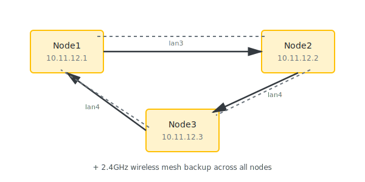
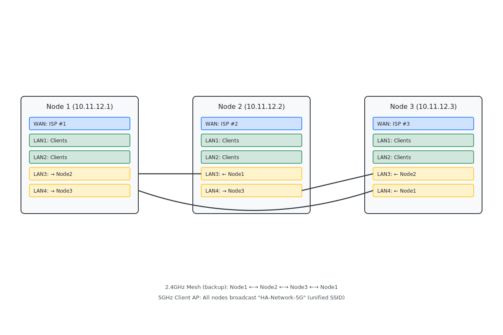
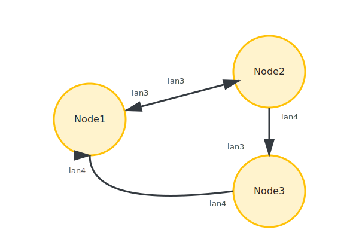

# OpenWrt Multi-Gateway Batman-adv Mesh Network

## Full Ring Topology with VLAN Support

### Network Design Overview

**Topology:** Full wired ring with 2.4GHz wireless backup
**Network:** 10.11.12.0/24
**Devices:** 3x D-Link DIR-1960 A1



### Detailed Port Layout



**Port Configuration:**

- **WAN (Blue)**: ISP connection for internet access
- **LAN1-LAN2 (Green)**: Client device connections
- **LAN3-LAN4 (Yellow)**: Mesh network connections to other nodes
- **2.4GHz Wireless**: Mesh backup (invisible to clients)
- **5GHz Wireless**: Client access point with unified SSID

### Client Connection Points

**Wired Clients:**

- LAN1 and LAN2 on each node (6 total ports available)
- All ports bridged to mesh network
- DHCP from Node1, gateway selection automatic

**Wireless Clients:**

- 5GHz unified SSID: "HA-Network-5G"
- Seamless roaming between nodes (802.11r)
- Same network as wired clients (10.11.12.0/24)

**Features:**

- Multi-gateway HA (all 3 nodes with independent WAN)
- Wired ring primary path
- 2.4GHz wireless automatic failover
- 5GHz client AP (unified SSID with 802.11r roaming)
- Wired client ports on every node (lan1, lan2)
- VLAN support over batman-adv mesh
- Automatic gateway selection and failover

---

## Port Allocation and Client Connectivity

### Per-Node Port Usage

Each DIR-1960 has 1 WAN port and 4 LAN ports. Here's how they're allocated:

| Port | Purpose | Connected To | Notes |
|------|---------|--------------|-------|
| WAN | Internet uplink | Your ISP modem/router | Independent per node |
| LAN1 | **Client devices** | Workstations, servers, etc. | Bridged to mesh |
| LAN2 | **Client devices** | Workstations, servers, etc. | Bridged to mesh |
| LAN3 | Mesh ring | Another node's LAN3 | Dedicated mesh |
| LAN4 | Mesh ring | Another node's LAN4 | Dedicated mesh |

### Wired Client Connectivity

**You can connect workstations/devices to LAN1 or LAN2 on ANY node:**

```
Workstation ─→ Node2 LAN1 ─→ br-lan bridge ─→ bat0 mesh
                                                  ↓
                                          Routes to all nodes
                                          Gets DHCP from Node1
                                          Internet via best gateway
```

**Key points:**

- **2 client ports per node** (LAN1, LAN2)
- **6 total wired clients** across 3-node mesh (2 per node)
- All clients on same 10.11.12.0/24 network
- DHCP provided by Node 1 (via mesh)
- Automatic gateway selection
- If local node loses WAN, traffic routes through mesh to another gateway

### Client Connection Examples

#### Example 1: Workstation on Node 2

```
Your PC ─→ Node2 LAN1
              ↓
         Gets: 10.11.12.105 (DHCP from Node1 via mesh)
         Gateway: 10.11.12.1
         DNS: 1.1.1.1, 8.8.8.8
         Internet: Via Node2's WAN (if available) or via mesh to Node1/Node3
```

#### Example 2: Multiple Workstations

```
Node1 LAN1 ─→ Management Workstation (10.11.12.10 - static)
Node1 LAN2 ─→ Gigabit Switch ─┬─ Server 1
                               ├─ Server 2
                               └─ NAS

Node2 LAN1 ─→ Desktop PC
Node2 LAN2 ─→ Available

Node3 LAN1 ─→ Laptop
Node3 LAN2 ─→ Available
```

#### Example 3: Node Failure Scenario

```
Initial state:
  Desktop PC ─→ Node2 LAN1 ─→ Internet via Node2 WAN

Node2 fails (power loss):
  Desktop PC loses connection until moved

Move cable to Node3:
  Desktop PC ─→ Node3 LAN1 ─→ Keeps same IP (10.11.12.105)
                           ─→ Internet via Node3 WAN
```

#### Example 4: WAN Failure, Not Node Failure

```
Initial state:
  Desktop PC ─→ Node2 LAN1 ─→ Internet via Node2 WAN

Node2's WAN fails:
  Desktop PC ─→ Node2 LAN1 ─→ bat0 mesh ─→ Node1 or Node3 WAN
                           ─→ Automatically reroutes!
                           ─→ PC stays connected, minimal disruption
```

### Expanding Wired Ports

**Option 1: Add Unmanaged Switch (Simplest)**

```
Node1 LAN1 ─→ Gigabit Switch ─┬─ Device 1
                               ├─ Device 2
                               ├─ Device 3
                               └─ Device 4
```

- Cheap and simple
- All devices on main LAN (10.11.12.0/24)
- No configuration needed

**Option 2: Managed Switch with VLANs (Advanced)**

```
Node1 LAN1 ─→ Managed Switch ─┬─ VLAN 10 devices (Management)
                               ├─ VLAN 20 devices (Trusted)
                               └─ VLAN 30 devices (Guest)
```

- Requires VLAN configuration (see VLAN section)
- Better security and segregation
- More complex setup

**Option 3: Sacrifice Ring Redundancy (Not Recommended)**

- Use only LAN3 for mesh (linear topology)
- Free up LAN4 for client use (3 client ports per node)
- Lose one wired path redundancy
- Only consider if you desperately need more ports

### Static IP Reservations

For servers or management workstations, add to Node 1's `/etc/config/dhcp`:

```bash
config host
    option name 'admin-workstation'
    option mac 'AA:BB:CC:DD:EE:FF'  # Workstation's MAC address
    option ip '10.11.12.10'

config host
    option name 'file-server'
    option mac '11:22:33:44:55:66'
    option ip '10.11.12.20'

config host
    option name 'nas'
    option mac '77:88:99:AA:BB:CC'
    option ip '10.11.12.30'
```

Benefits:

- Consistent IP addresses
- Easy to remember/document
- Works regardless of which node device connects to

### Performance Considerations

**Best case (local WAN available):**

```
Workstation → Node LAN1 → Local WAN
Latency: <2ms to internet
Throughput: Full WAN speed
```

**Mesh routing case (local WAN down):**

```
Workstation → Node LAN1 → bat0 → Ring → Other Node → WAN
Latency: +2-5ms overhead
Throughput: Limited by mesh (400-900 Mbps wired, 50-200 Mbps wireless)
```

For maximum performance:

- Connect high-bandwidth devices to the node with the fastest WAN
- Use wired mesh paths (keep all ring cables connected)
- Consider static gateway assignment if needed

### Verifying Client Connectivity

After connecting a workstation to any LAN1/LAN2:

```bash
# From the workstation

# Check IP assignment
ip addr show eth0  # or your interface name
# Should show: 10.11.12.x

# Check gateway
ip route show
# Should show: default via 10.11.12.1

# Test connectivity to all nodes
ping -c 3 10.11.12.1
ping -c 3 10.11.12.2
ping -c 3 10.11.12.3

# Test internet
ping -c 3 1.1.1.1
ping -c 3 google.com
```

---

## Table of Contents

1. [Prerequisites](#prerequisites)
2. [Hardware Preparation](#hardware-preparation)
3. [Initial OpenWrt Installation](#initial-openwrt-installation)
4. [Physical Wiring](#physical-wiring)
5. [Base Configuration](#base-configuration)
6. [Node-Specific Configurations](#node-specific-configurations)
7. [VLAN Configuration](#vlan-configuration)
8. [Testing & Verification](#testing--verification)
9. [Monitoring & Maintenance](#monitoring--maintenance)
10. [Troubleshooting](#troubleshooting)

---

## Prerequisites

### Required Hardware

- 3x D-Link DIR-1960 A1 routers
- 3x Ethernet cables (ring interconnects)
- 3x Independent internet connections
- 1x Computer with Ethernet port for initial setup

### Required Software/Packages

- OpenWrt 23.05 or later (snapshot recommended for latest batman-adv)
- Packages to install on each node:
  - `kmod-batman-adv` - Batman kernel module
  - `batctl` - Batman control utility
  - `wpad-mesh-mbedtls` or `wpad-mesh-wolfssl` - Mesh WiFi support
  - `ip-full` - Enhanced IP utilities
  - `tcpdump-mini` - Network debugging (optional but recommended)

### Network Planning

| Node | IP Address | WAN Port | Mesh Ports | Role |
|------|------------|----------|------------|------|
| Node1 | 10.11.12.1 | wan | lan3→Node2, lan4→Node3 | Gateway + DHCP Server |
| Node2 | 10.11.12.2 | wan | lan3→Node1, lan4→Node3 | Gateway |
| Node3 | 10.11.12.3 | wan | lan3→Node2, lan4→Node1 | Gateway |

**Port Usage:**

- `wan` - Internet uplink
- `lan1, lan2` - Client devices (bridged to mesh)
- `lan3, lan4` - Mesh ring interconnects
- `radio0` (2.4GHz) - Wireless mesh backup
- `radio1` (5GHz) - Client AP

---

## Hardware Preparation

### 1. Label Your Routers

Physically label each router as Node1, Node2, Node3 to avoid confusion during setup.

### 2. Verify Hardware Revision

Ensure you have DIR-1960 **A1** revision. Check the label on the bottom of the router.

### 3. Backup Original Firmware (Optional)

If you want to revert to stock firmware later, backup using the emergency recovery console before flashing OpenWrt.

---

## Initial OpenWrt Installation

### Download Firmware

Visit OpenWrt firmware selector: <https://firmware-selector.openwrt.org/>

Search for: `D-Link DIR-1960 A1`

Download:

- **Factory image** (for initial flash from stock firmware)
- **Sysupgrade image** (for future updates)

### Flash Process (Per Router)

1. **Enter Recovery Mode:**
   - Disconnect power from router
   - Press and hold RESET button
   - While holding RESET, connect power
   - Continue holding until Power LED starts flashing (orange) - about 10 seconds
   - Release RESET button

2. **Configure Computer:**
   - Connect computer to LAN1 port
   - Set static IP on computer:
     - IP: `192.168.0.2`
     - Netmask: `255.255.255.0`
     - Gateway: `192.168.0.1`

3. **Access Recovery Interface:**
   - Open browser to: `http://192.168.0.1`
   - You should see D-Link Emergency Recovery page

4. **Upload Firmware:**
   - Browse and select the OpenWrt **factory** image
   - Click "Upload"
   - Wait 3-5 minutes for flash and reboot
   - Do NOT interrupt power during this process

5. **Verify Installation:**
   - After reboot, browse to `http://192.168.1.1`
   - You should see OpenWrt LuCI interface
   - Default: no password set

6. **Set Root Password:**  <!-- pragma: allowlist secret -->
   - SSH to router: `ssh root@192.168.1.1` (no password initially)
   - Set password: `passwd`  <!-- pragma: allowlist secret -->
   - Or via LuCI: System → Administration → Router Password

7. **Update Package Lists:**

   ```bash
   opkg update
   ```

**Repeat for all three routers before proceeding.**

---

## Physical Wiring

### Ring Topology Connections



**Physical Connections:**

- Node1 lan3 ↔ Node2 lan3
- Node2 lan4 → Node3 lan3
- Node3 lan4 → Node1 lan4

### Cable Mapping

| Connection | Cable |
|------------|-------|
| Node1 lan3 to Node2 lan3 | Cable A |
| Node2 lan4 to Node3 lan3 | Cable B |
| Node3 lan4 to Node1 lan4 | Cable C |

### WAN Connections

Each node's WAN port connects to its independent internet connection (different cables, ideally different ISPs).

### Client Devices

- Can connect via Ethernet to lan1 or lan2 on any node
- Can connect via WiFi to the unified 5GHz AP

---

## Base Configuration

These files are common across all nodes with only IP addresses changing.

### Install Required Packages

SSH to each router and run:

```bash
# Remove conflicting package first
opkg remove wpad-basic-mbedtls

# Install required packages
opkg update
opkg install kmod-batman-adv batctl wpad-mesh-mbedtls ip-full tcpdump-mini

# Reboot to load batman kernel module
reboot
```

Verify batman module loaded:

```bash
lsmod | grep batman
# Should show: batman_adv
```

---

## Node-Specific Configurations

### Node 1 Configuration (10.11.12.1)

#### /etc/config/network

```bash
config interface 'loopback'
 option device 'lo'
 option proto 'static'
 option ipaddr '127.0.0.1'
 option netmask '255.0.0.0'

config globals 'globals'
 option ula_prefix 'fd12:3456:789a::/48'

# WAN Interface
config interface 'wan'
 option device 'wan'
 option proto 'dhcp'
 option peerdns '0'
 option dns '1.1.1.1 8.8.8.8'

config interface 'wan6'
 option device 'wan'
 option proto 'dhcpv6'

# Batman-adv Main Interface
config interface 'bat0'
 option proto 'batadv'
 option routing_algo 'BATMAN_V'
 option gw_mode 'server'
 option gw_bandwidth '100000/100000'
 option distributed_arp_table '1'
 option bridge_loop_avoidance '1'
 option multicast_mode '1'
 option fragmentation '1'
 option hop_penalty '15'
 option orig_interval '1000'

# Wired mesh interface - lan3 to Node2
config interface 'bat0_hardif_lan3'
 option proto 'batadv_hardif'
 option master 'bat0'
 option mtu '1560'

# Wired mesh interface - lan4 to Node3
config interface 'bat0_hardif_lan4'
 option proto 'batadv_hardif'
 option master 'bat0'
 option mtu '1560'

# Wireless mesh interface - 2.4GHz backup
config interface 'bat0_hardif_mesh0'
 option proto 'batadv_hardif'
 option master 'bat0'
 option mtu '1532'

# Physical device for mesh ports
config device 'lan3'
 option name 'lan3'
 option mtu '1560'

config device 'lan4'
 option name 'lan4'
 option mtu '1560'

# LAN Bridge
config device 'br_lan'
 option name 'br-lan'
 option type 'bridge'
 list ports 'bat0'
 list ports 'lan1'
 list ports 'lan2'
 # Note: lan3 and lan4 NOT in bridge - dedicated to mesh

config interface 'lan'
 option device 'br-lan'
 option proto 'static'
 option ipaddr '10.11.12.1'
 option netmask '255.255.255.0'
 option ip6assign '60'

# IMPORTANT: The br-lan bridge connects:
#   - bat0 (batman mesh)
#   - lan1 (client devices)
#   - lan2 (client devices)
# This allows workstations on lan1/lan2 to access the mesh network
# and get DHCP, internet, and connectivity to all mesh nodes.
```

#### /etc/config/wireless

```bash
config wifi-device 'radio0'
 option type 'mac80211'
 option path 'platform/soc/1e140000.pcie/pci0000:00/0000:00:01.0/0000:01:00.0'
 option channel '6'
 option band '2g'
 option htmode 'HT40'
 option country 'AU'
 option cell_density '0'

# 2.4GHz Mesh Backup
config wifi-iface 'mesh0'
 option device 'radio0'
 option mode 'mesh'
 option network 'bat0_hardif_mesh0'
 option mesh_id 'ha-mesh-net'
 option mesh_fwding '0'
 option mesh_ttl '1'
 option encryption 'sae'
 option key 'YourSecureMeshPassword123!'
 option mcast_rate '24000'

config wifi-device 'radio1'
 option type 'mac80211'
 option path 'platform/soc/1e140000.pcie/pci0000:00/0000:00:00.0/0000:00:00.0'
 option channel '36'
 option band '5g'
 option htmode 'VHT80'
 option country 'AU'
 option cell_density '0'

# 5GHz Client AP
config wifi-iface 'wlan0'
 option device 'radio1'
 option mode 'ap'
 option network 'lan'
 option ssid 'HA-Network-5G'
 option encryption 'psk2+ccmp'
 option key 'YourClientPassword123!'
 option ieee80211r '1'
 option mobility_domain 'a1b2'
 option ft_over_ds '1'
 option ft_psk_generate_local '1'
 option rsn_preauth '1'
```

#### /etc/config/dhcp

```bash
config dnsmasq
 option domainneeded '1'
 option boguspriv '1'
 option filterwin2k '0'
 option localise_queries '1'
 option rebind_protection '1'
 option rebind_localhost '1'
 option local '/lan/'
 option domain 'lan'
 option expandhosts '1'
 option nonegcache '0'
 option cachesize '1000'
 option authoritative '1'
 option readethers '1'
 option leasefile '/tmp/dhcp.leases'
 option resolvfile '/tmp/resolv.conf.d/resolv.conf.auto'
 option nonwildcard '1'
 option localservice '1'
 option ednspacket_max '1232'

config dhcp 'lan'
 option interface 'lan'
 option start '100'
 option limit '150'
 option leasetime '12h'
 option dhcpv4 'server'
 option dhcpv6 'server'
 option ra 'server'
 list ra_flags 'managed-config'
 list ra_flags 'other-config'

config dhcp 'wan'
 option interface 'wan'
 option ignore '1'

config odhcpd 'odhcpd'
 option maindhcp '0'
 option leasefile '/tmp/hosts/odhcpd'
 option leasetrigger '/usr/sbin/odhcpd-update'
 option loglevel '4'
```

#### /etc/config/firewall

```bash
config defaults
 option input 'REJECT'
 option output 'ACCEPT'
 option forward 'REJECT'
 option synflood_protect '1'

config zone
 option name 'lan'
 list network 'lan'
 option input 'ACCEPT'
 option output 'ACCEPT'
 option forward 'ACCEPT'

config zone
 option name 'wan'
 list network 'wan'
 list network 'wan6'
 option input 'REJECT'
 option output 'ACCEPT'
 option forward 'REJECT'
 option masq '1'
 option mtu_fix '1'

config forwarding
 option src 'lan'
 option dest 'wan'

# Allow ICMP
config rule
 option name 'Allow-DHCP-Renew'
 option src 'wan'
 option proto 'udp'
 option dest_port '68'
 option target 'ACCEPT'
 option family 'ipv4'

config rule
 option name 'Allow-Ping'
 option src 'wan'
 option proto 'icmp'
 option icmp_type 'echo-request'
 option family 'ipv4'
 option target 'ACCEPT'

config rule
 option name 'Allow-IGMP'
 option src 'wan'
 option proto 'igmp'
 option family 'ipv4'
 option target 'ACCEPT'

config rule
 option name 'Allow-DHCPv6'
 option src 'wan'
 option proto 'udp'
 option dest_port '546'
 option family 'ipv6'
 option target 'ACCEPT'

config rule
 option name 'Allow-MLD'
 option src 'wan'
 option proto 'icmp'
 option src_ip 'fe80::/10'
 list icmp_type '130/0'
 list icmp_type '131/0'
 list icmp_type '132/0'
 list icmp_type '143/0'
 option family 'ipv6'
 option target 'ACCEPT'

config rule
 option name 'Allow-ICMPv6-Input'
 option src 'wan'
 option proto 'icmp'
 list icmp_type 'echo-request'
 list icmp_type 'echo-reply'
 list icmp_type 'destination-unreachable'
 list icmp_type 'packet-too-big'
 list icmp_type 'time-exceeded'
 list icmp_type 'bad-header'
 list icmp_type 'unknown-header-type'
 list icmp_type 'router-solicitation'
 list icmp_type 'neighbour-solicitation'
 list icmp_type 'router-advertisement'
 list icmp_type 'neighbour-advertisement'
 option limit '1000/sec'
 option family 'ipv6'
 option target 'ACCEPT'

config rule
 option name 'Allow-ICMPv6-Forward'
 option src 'wan'
 option dest '*'
 option proto 'icmp'
 list icmp_type 'echo-request'
 list icmp_type 'echo-reply'
 list icmp_type 'destination-unreachable'
 list icmp_type 'packet-too-big'
 list icmp_type 'time-exceeded'
 list icmp_type 'bad-header'
 list icmp_type 'unknown-header-type'
 option limit '1000/sec'
 option family 'ipv6'
 option target 'ACCEPT'

config rule
 option name 'Allow-IPSec-ESP'
 option src 'wan'
 option dest 'lan'
 option proto 'esp'
 option target 'ACCEPT'

config rule
 option name 'Allow-ISAKMP'
 option src 'wan'
 option dest 'lan'
 option dest_port '500'
 option proto 'udp'
 option target 'ACCEPT'
```

---

### Node 2 Configuration (10.11.12.2)

**Changes from Node 1:**

#### /etc/config/network

```bash
# Change only these lines:
config interface 'lan'
 option device 'br-lan'
 option proto 'static'
 option ipaddr '10.11.12.2'  # Changed
 option netmask '255.255.255.0'
 option ip6assign '60'
 option gateway '10.11.12.1'  # Add this
 list dns '10.11.12.1'        # Add this
```

#### /etc/config/dhcp

```bash
# Disable DHCP server on Node 2
config dhcp 'lan'
 option interface 'lan'
 option ignore '1'  # Changed to disable DHCP
```

**All other configuration files remain identical to Node 1.**

---

### Node 3 Configuration (10.11.12.3)

**Changes from Node 1:**

#### /etc/config/network

```bash
# Change only these lines:
config interface 'lan'
 option device 'br-lan'
 option proto 'static'
 option ipaddr '10.11.12.3'  # Changed
 option netmask '255.255.255.0'
 option ip6assign '60'
 option gateway '10.11.12.1'  # Add this
 list dns '10.11.12.1'        # Add this
```

#### /etc/config/dhcp

```bash
# Disable DHCP server on Node 3
config dhcp 'lan'
 option interface 'lan'
 option ignore '1'  # Changed to disable DHCP
```

**All other configuration files remain identical to Node 1.**

---

## VLAN Configuration

Batman-adv supports VLANs for network segmentation over the mesh. Common use cases:

- VLAN 10: Management
- VLAN 20: Trusted clients
- VLAN 30: Guest network
- VLAN 40: IoT devices

### Enable VLAN Support

Add to each node's `/etc/config/network`:

```bash
# VLAN 10 - Management (example)
config interface 'mgmt'
 option proto 'batadv_vlan'
 option master 'bat0'
 option vid '10'
 option ap_isolation '0'

config interface 'mgmt_bridge'
 option proto 'static'
 option type 'bridge'
 list ports 'mgmt'
 option ipaddr '10.11.10.1'  # Different subnet
 option netmask '255.255.255.0'

# VLAN 20 - Trusted Clients (example)
config interface 'trusted'
 option proto 'batadv_vlan'
 option master 'bat0'
 option vid '20'
 option ap_isolation '0'

config interface 'trusted_bridge'
 option proto 'static'
 option type 'bridge'
 list ports 'trusted'
 option ipaddr '10.11.20.1'
 option netmask '255.255.255.0'

# VLAN 30 - Guest Network (example)
config interface 'guest'
 option proto 'batadv_vlan'
 option master 'bat0'
 option vid '30'
 option ap_isolation '1'  # Isolate guest clients

config interface 'guest_bridge'
 option proto 'static'
 option type 'bridge'
 list ports 'guest'
 option ipaddr '10.11.30.1'
 option netmask '255.255.255.0'
```

### Add VLAN-Aware WiFi Interfaces

Modify `/etc/config/wireless` to add VLAN-specific SSIDs:

```bash
# Guest WiFi on VLAN 30
config wifi-iface 'guest_wifi'
 option device 'radio1'
 option mode 'ap'
 option network 'guest_bridge'
 option ssid 'HA-Guest'
 option encryption 'psk2+ccmp'
 option key 'GuestPassword123!'
 option isolate '1'
```

### Configure VLAN Firewall Rules

Add to `/etc/config/firewall`:

```bash
# Guest VLAN zone
config zone
 option name 'guest'
 list network 'guest_bridge'
 option input 'REJECT'
 option output 'ACCEPT'
 option forward 'REJECT'

config forwarding
 option src 'guest'
 option dest 'wan'

# Block guest access to LAN
config rule
 option name 'Block-Guest-to-LAN'
 option src 'guest'
 option dest 'lan'
 option target 'REJECT'
```

### Enable DHCP for VLANs

Add to `/etc/config/dhcp` on Node 1 only:

```bash
config dhcp 'mgmt'
 option interface 'mgmt_bridge'
 option start '100'
 option limit '50'
 option leasetime '12h'

config dhcp 'trusted'
 option interface 'trusted_bridge'
 option start '100'
 option limit '100'
 option leasetime '12h'

config dhcp 'guest'
 option interface 'guest_bridge'
 option start '100'
 option limit '50'
 option leasetime '2h'
```

---

## Testing & Verification

### Initial Connectivity Tests

#### 1. Verify Batman Interfaces

On each node:

```bash
batctl if
```

Expected output:

```
lan3: active
lan4: active
mesh0: active
```

#### 2. Check Mesh Topology

```bash
batctl o
```

Expected output showing all nodes with multiple paths:

```
[B.A.T.M.A.N. adv 2023.0, MainIF/MAC: lan3/xx:xx:xx:xx:xx:xx (bat0)]
  Originator        last-seen (#/255) Nexthop           [outgoingIF]
  10.11.12.2        0.420s   (255) 10.11.12.2 [  lan3]
  10.11.12.2        0.520s   (255) 10.11.12.2 [  lan4] via 10.11.12.3
  10.11.12.2        0.640s   (180) 10.11.12.2 [ mesh0]
  10.11.12.3        0.340s   (255) 10.11.12.3 [  lan4]
  10.11.12.3        0.520s   (255) 10.11.12.3 [  lan3] via 10.11.12.2
  10.11.12.3        0.680s   (165) 10.11.12.3 [ mesh0]
```

Key observations:

- TQ value of 255 = perfect wired connection
- TQ value 150-200 = good wireless connection
- Multiple paths to same destination = redundancy working

#### 3. Check Gateway Status

```bash
batctl gwl
```

Expected output:

```
[B.A.T.M.A.N. adv 2023.0, MainIF/MAC: lan3/xx:xx:xx:xx:xx:xx (bat0)]
   Router            ( throughput) Next Hop          [outgoingIF]
=> 10.11.12.1           (100.0 MBit) 10.11.12.1          [  lan3]
 * 10.11.12.2           (100.0 MBit) 10.11.12.2          [  lan3]
   10.11.12.3           (100.0 MBit) 10.11.12.3          [  lan4]
```

- `=>` = currently selected gateway
- `*` = available backup gateways

#### 4. Ping Test Between Nodes

From Node 1:

```bash
ping -c 5 10.11.12.2
ping -c 5 10.11.12.3
```

Should get responses with low latency (<5ms on wired).

#### 5. Test Internet Connectivity

From any node:

```bash
ping -c 5 1.1.1.1
ping -c 5 google.com
```

Should work via whichever gateway batman selected.

#### 6. Test Wired Client Connectivity

Connect a workstation to LAN1 or LAN2 on any node:

**From the workstation:**

```bash
# Check DHCP assignment
ip addr show eth0  # Replace eth0 with your interface
# Should show: inet 10.11.12.xxx/24

# Verify gateway
ip route show
# Should show: default via 10.11.12.1

# Test connectivity to all nodes
ping -c 3 10.11.12.1
ping -c 3 10.11.12.2  
ping -c 3 10.11.12.3

# Test internet
ping -c 5 1.1.1.1
curl -I https://google.com
```

**Verify which gateway the workstation is using:**

```bash
# On any mesh node, check the client's MAC
batctl tl  # Translation table - shows all known clients

# Check gateway selection for traffic
batctl gwl
```

**Test mobility:**

1. Connect workstation to Node1 LAN1, note IP address
2. Move cable to Node2 LAN1
3. Verify same IP retained (DHCP lease preserved)
4. Verify connectivity maintained

### Failover Testing

#### Test 1: Single Wire Failure

**Scenario:** Disconnect Node1-Node2 cable (lan3)

1. Before disconnect:

   ```bash
   watch -n 1 'batctl o | grep 10.11.12.2'
   ```

2. Disconnect cable between Node1 lan3 and Node2 lan3

3. Observe routing change:
   - Traffic from Node1 to Node2 now routes via Node3 (lan4)
   - Or via mesh0 if wireless is faster
   - Failover should occur within 1-3 seconds

4. Test connectivity:

   ```bash
   ping -c 10 10.11.12.2
   ```

   Should continue working with minimal packet loss.

5. Reconnect cable - should revert to direct path

#### Test 2: Node Failure

**Scenario:** Power off Node2 completely

1. From Node1, continuous ping to Node3:

   ```bash
   ping 10.11.12.3
   ```

2. Power off Node2

3. Observe:
   - Node1 ↔ Node3 wired path via Node2 fails
   - Batman automatically routes via mesh0 (2.4GHz wireless)
   - Or via remaining wired path if ring was complete

4. Check new topology:

   ```bash
   batctl o
   ```

   Node2 should disappear from originator list.

#### Test 3: Gateway Failover

**Scenario:** Disconnect WAN on active gateway

1. Identify current gateway from client perspective:

   ```bash
   # On any node
   batctl gwl
   ```

2. Find which node client is currently using (look for `=>`)

3. Disconnect that node's WAN cable

4. Observe gateway switch:

   ```bash
   watch -n 1 batctl gwl
   ```

5. Client should automatically select new gateway within 5-30 seconds

6. Test client internet:

   ```bash
   ping -c 10 1.1.1.1
   ```

   May see 1-2 packets dropped during switchover.

#### Test 4: Complete Wired Mesh Failure

**Scenario:** Disconnect all three wired cables

1. Monitor mesh status:

   ```bash
   watch -n 1 'batctl o'
   ```

2. Disconnect all wired ring cables

3. Observe:
   - All paths switch to mesh0 (2.4GHz)
   - TQ values drop from 255 to ~150-200
   - Network remains functional

4. Performance test:

   ```bash
   # From Node1 to Node2
   iperf3 -c 10.11.12.2
   ```

   Compare wired vs wireless throughput.

#### Test 5: Wired Client During Node Failure

**Scenario:** Workstation connected to node that fails

1. **Setup:**
   - Connect workstation to Node2 LAN1
   - Verify internet connectivity
   - Note IP address (e.g., 10.11.12.105)

2. **Simulate Node2 power failure:**
   - Unplug Node2 power
   - Workstation loses connection (expected)

3. **Recovery:**
   - Move workstation cable to Node1 LAN1 or Node3 LAN1
   - Workstation should get same IP (DHCP lease preserved)
   - Verify connectivity restored

   ```bash
   ping 10.11.12.1
   ping 1.1.1.1
   ```

#### Test 6: Wired Client During WAN Failure (Node Stays Up)

**Scenario:** Node's WAN fails but node remains powered

1. **Setup:**
   - Connect workstation to Node2 LAN1
   - Continuous ping to internet:

   ```bash
   ping 1.1.1.1
   ```

2. **Disconnect Node2's WAN cable**

3. **Observe:**
   - Workstation stays connected to Node2 LAN1
   - May see 1-3 packets dropped during gateway switch (~5-30 seconds)
   - Traffic automatically reroutes through mesh to Node1 or Node3
   - Ping resumes automatically

4. **Verify new path:**

   ```bash
   # On Node2
   batctl gwl
   # Should show different gateway selected

   traceroute 1.1.1.1
   # Should show path through mesh
   ```

5. **Reconnect Node2 WAN:**
   - Should switch back to local gateway
   - Workstation stays connected throughout

**Key observation:** Workstation never loses connection to mesh when only WAN fails!

### Performance Testing

#### Throughput Test

**Setup iperf3 server on Node2:**

```bash
ssh root@10.11.12.2
opkg update && opkg install iperf3
iperf3 -s
```

**Test from Node1:**

```bash
# Wired ring active
iperf3 -c 10.11.12.2 -t 30

# Disconnect wire, test wireless
iperf3 -c 10.11.12.2 -t 30

# Compare results
```

Expected results:

- Wired: 400-900 Mbps (depends on path: direct or via Node3)
- Wireless: 50-200 Mbps (depends on distance and interference)

#### Latency Test

```bash
# Install hping3 for detailed latency tests
opkg install hping3

# Test latency
hping3 -c 100 10.11.12.2
```

Expected:

- Wired direct: <2ms
- Wired via intermediate node: 2-5ms
- Wireless: 5-20ms

### VLAN Testing (if configured)

#### Test VLAN Isolation

```bash
# From guest VLAN client, try to reach LAN
ping 10.11.12.1  # Should fail if firewall rules correct

# From guest VLAN, test internet
ping 1.1.1.1     # Should work
```

#### Test VLAN Mobility

Connect a client to guest WiFi on Node1, then move to Node2's coverage area:

- Client should roam seamlessly
- VLAN membership should be maintained
- IP address should remain the same (same DHCP server)

---

## Monitoring & Maintenance

### Create Monitoring Script

Create `/root/mesh_monitor.sh`:

```bash
#!/bin/sh

# Mesh Network Monitor Script
# Usage: ./mesh_monitor.sh

clear

echo "========================================"
echo " Batman-adv Mesh Network Status"
echo " Generated: $(date)"
echo "========================================"
echo ""

echo "--- Local Node Info ---"
echo "Hostname: $(uci get system.@system[0].hostname)"
echo "IP Address: $(ip -4 addr show br-lan | grep -oP '(?<=inet\s)\d+(\.\d+){3}')"
echo "Uptime: $(uptime | awk '{print $3,$4}' | sed 's/,//')"
echo ""

echo "--- Batman Interfaces ---"
batctl if
echo ""

echo "--- Mesh Topology ---"
batctl o | head -10
echo ""

echo "--- Gateway Status ---"
batctl gwl
echo ""

echo "--- Neighbor Info ---"
batctl n
echo ""

echo "--- Link Quality Details ---"
for iface in lan3 lan4 mesh0; do
    if [ -d "/sys/class/net/$iface" ]; then
        echo "$iface status:"
        echo "  State: $(cat /sys/class/net/$iface/operstate 2>/dev/null || echo 'N/A')"

        if [ "$iface" = "mesh0" ]; then
            echo "  Mesh peers:"
            iw dev mesh0 station dump 2>/dev/null | grep -E "Station|signal:" | head -6
        fi
        echo ""
    fi
done

echo "--- WAN Status ---"
for iface in wan; do
    if ip link show $iface up 2>/dev/null | grep -q UP; then
        echo "WAN: UP"
        ping -c 1 -W 2 1.1.1.1 >/dev/null 2>&1 && echo "Internet: OK" || echo "Internet: FAILED"
    else
        echo "WAN: DOWN"
    fi
done
echo ""

echo "--- Recent Batman Logs ---"
logread | grep -i batman | tail -5
echo ""

echo "========================================"
echo " Monitor script completed"
echo "========================================"
```

Make executable:

```bash
chmod +x /root/mesh_monitor.sh
```

Run it:

```bash
/root/mesh_monitor.sh
```

### Continuous Monitoring

For real-time monitoring:

```bash
watch -n 2 '/root/mesh_monitor.sh'
```

### Key Metrics to Monitor

1. **Originator TQ (Transmit Quality):**
   - 255 = Perfect
   - 200-254 = Excellent
   - 150-199 = Good
   - 100-149 = Fair
   - <100 = Poor

2. **Gateway Selection:**
   - Should be stable (not switching frequently)
   - Clients should distribute across gateways

3. **Interface Status:**
   - All batman interfaces should show "active"
   - Ethernet ports should show "UP"

4. **Mesh Peering:**

   ```bash
   iw dev mesh0 station dump
   ```

   - Should show `mesh plink: ESTAB` for each peer

### Log Monitoring

```bash
# Watch batman logs in real-time
logread -f | grep -i batman

# Check for errors
logread | grep -i "batman.*error"

# Check for gateway changes
logread | grep -i "gw"
```

### Performance Monitoring

Create `/root/performance_test.sh`:

```bash
#!/bin/sh

echo "=== Performance Test ==="
echo "Date: $(date)"
echo ""

# Test to other nodes
for ip in 10.11.12.1 10.11.12.2 10.11.12.3; do
    current_ip=$(ip -4 addr show br-lan | grep -oP '(?<=inet\s)\d+(\.\d+){3}')
    if [ "$ip" != "$current_ip" ]; then
        echo "Testing to $ip:"
        ping -c 10 -q $ip | tail -1
        echo ""
    fi
done

echo "=== Internet Connectivity ==="
ping -c 10 -q 1.1.1.1 | tail -1
echo ""

echo "=== Current Routes ==="
batctl o | grep "^\s*10.11.12"
echo ""
```

### Scheduled Monitoring (Optional)

Add to crontab for automated monitoring:

```bash
# Edit crontab
crontab -e

# Add these lines:
# Run mesh monitor every hour and save to log
0 * * * * /root/mesh_monitor.sh >> /tmp/mesh_monitor.log 2>&1

# Run performance test every 4 hours
0 */4 * * * /root/performance_test.sh >> /tmp/performance_test.log 2>&1

# Rotate logs daily (keep last 7 days)
0 0 * * * tail -1000 /tmp/mesh_monitor.log > /tmp/mesh_monitor.log.tmp && mv /tmp/mesh_monitor.log.tmp /tmp/mesh_monitor.log
```

---

## Troubleshooting

### Issue: Batman Interface Not Active

**Symptoms:**

```bash
batctl if
# Shows: No batman interfaces found
```

**Solutions:**

1. Check batman module loaded:

   ```bash
   lsmod | grep batman
   # If not present:
   modprobe batman-adv
   ```

2. Verify interface configuration:

   ```bash
   uci show network | grep batadv
   ```

3. Restart network:

   ```bash
   /etc/init.d/network restart
   ```

4. Check for errors:

   ```bash
   logread | grep -i batman
   ```

### Issue: Mesh Peers Not Connecting

**Symptoms:**

```bash
batctl o
# Shows no originators or only some nodes
```

**Solutions:**

1. **Check wireless mesh:**

   ```bash
   iw dev mesh0 station dump
   ```

   Should show peers with `mesh plink: ESTAB`

2. **Verify mesh settings match:**
   - Same mesh_id on all nodes
   - Same encryption key
   - Same channel

3. **Check mesh0 interface is up:**

   ```bash
   ip link show mesh0
   # Should show: state UP
   ```

4. **Verify wired connections:**

   ```bash
   ip link show lan3
   ip link show lan4
   # Should show: state UP
   ```

5. **Check physical cables** - ensure all connections are secure

### Issue: Low TQ Values on Wired Links

**Symptoms:**

```bash
batctl o
# Wired interfaces showing TQ < 200 instead of 255
```

**Solutions:**

1. **Check MTU settings:**

   ```bash
   ip link show lan3
   ip link show lan4
   # Should show mtu 1560
   ```

2. **Verify no speed/duplex mismatch:**

   ```bash
   ethtool lan3
   # Should show: 1000baseT/Full
   ```

3. **Check for packet errors:**

   ```bash
   ip -s link show lan3
   # Look at RX/TX errors
   ```

4. **Test cable quality:**

   ```bash
   # On connected nodes, ping with large packets
   ping -M do -s 1500 10.11.12.2
   ```

### Issue: Gateway Not Switching on Failover

**Symptoms:**

- Disconnected WAN on gateway
- Clients lose internet instead of switching

**Solutions:**

1. **Check gateway configuration:**

   ```bash
   batctl gw_mode
   # Should show: server on all nodes
   ```

2. **Verify gateway bandwidth announced:**

   ```bash
   uci show network.bat0.gw_bandwidth
   ```

3. **Check gateway selection algorithm:**

   ```bash
   batctl gwl
   # Verify multiple gateways listed
   ```

4. **Force gateway reselection:**

   ```bash
   # On client node
   batctl gw_mode client
   sleep 2
   batctl gw_mode off
   ```

5. **Check routing:**

   ```bash
   ip route show
   # Should show default via 10.11.12.x
   ```

### Issue: Clients Can't Get DHCP

**Symptoms:**

- Wireless clients connect but no IP
- Ethernet clients no IP

**Solutions:**

1. **Verify DHCP running on Node 1:**

   ```bash
   # On Node 1
   ps | grep dnsmasq
   ```

2. **Check DHCP configuration:**

   ```bash
   uci show dhcp.lan
   # Verify ignore != '1'
   ```

3. **Verify bridge includes bat0:**

   ```bash
   brctl show br-lan
   # Should list bat0
   ```

4. **Check firewall:**

   ```bash
   iptables -L -n -v | grep "dpt:67"
   ```

5. **Restart DHCP:**

   ```bash
   /etc/init.d/dnsmasq restart
   ```

6. **Test DHCP manually:**

   ```bash
   # From client
   dhclient -v wlan0
   ```

### Issue: Wired Client Can't Connect

**Symptoms:**

- Cable plugged into LAN1/LAN2 but no connectivity
- No IP address assigned

**Solutions:**

1. **Verify port is in bridge:**

   ```bash
   brctl show br-lan
   # Should list lan1 and lan2
   ```

2. **Check physical link:**

   ```bash
   ip link show lan1
   # Should show: state UP

   ethtool lan1
   # Should show: Link detected: yes
   ```

3. **Verify switch port (if using switch):**
   - Check switch link lights
   - Try different switch port
   - Test with known-good cable

4. **Check interface status:**

   ```bash
   uci show network | grep "lan1\|lan2"
   ```

5. **Test with static IP:**

   ```bash
   # On client workstation, temporarily set static:
   ip addr add 10.11.12.200/24 dev eth0
   ip route add default via 10.11.12.1
   ping 10.11.12.1
   ```

6. **Check DHCP logs:**

   ```bash
   logread | grep -i dhcp
   # Look for DHCPDISCOVER and DHCPOFFER
   ```

### Issue: Client Gets IP But No Internet

**Symptoms:**

- DHCP works (10.11.12.x IP assigned)
- Can ping mesh nodes (10.11.12.1, .2, .3)
- Cannot reach internet

**Solutions:**

1. **Check gateway selection:**

   ```bash
   # On any node
   batctl gwl
   # Ensure at least one gateway available (=>)
   ```

2. **Verify NAT/masquerading:**

   ```bash
   iptables -t nat -L POSTROUTING -v -n
   # Should show MASQUERADE rule for wan
   ```

3. **Check WAN connectivity:**

   ```bash
   # On each node
   ping -I wan 1.1.1.1
   ```

4. **Verify DNS:**

   ```bash
   # From client
   cat /etc/resolv.conf
   # Should show: nameserver 10.11.12.1 or public DNS

   # Test DNS
   nslookup google.com
   ```

5. **Check firewall rules:**

   ```bash
   iptables -L FORWARD -v -n
   # Should allow lan -> wan
   ```

6. **Test with explicit gateway:**

   ```bash
   # From client
   ping -c 3 1.1.1.1
   traceroute 1.1.1.1
   # Verify path through gateway
   ```

### Issue: Client Connectivity Lost During Failover

**Symptoms:**

- Prolonged connection loss during WAN/node failover
- Expected 5-30 seconds, experiencing minutes

**Solutions:**

1. **Check gateway selection interval:**

   ```bash
   # Should switch within 30 seconds
   watch -n 1 'batctl gwl'
   ```

2. **Verify batman routing updates:**

   ```bash
   uci show network.bat0.orig_interval
   # Should be 1000 or less

   # If too high, reduce:
   uci set network.bat0.orig_interval='500'
   uci commit network
   /etc/init.d/network restart
   ```

3. **Check for routing loops:**

   ```bash
   traceroute 1.1.1.1
   # Should be simple path, no loops
   ```

4. **Verify multiple gateways available:**

   ```bash
   batctl gwl
   # Should list 2-3 gateways with * markers
   ```

5. **Check client's ARP cache:**

   ```bash
   # From client
   ip neigh flush all
   # Forces ARP refresh
   ```

### Issue: Slow Performance on Wired Client

**Symptoms:**

- Wired client getting poor throughput
- High latency

**Solutions:**

1. **Check link speed:**

   ```bash
   # On router
   ethtool lan1
   # Should show: 1000baseT/Full
   ```

2. **Verify not routing through wireless:**

   ```bash
   batctl o | grep -A2 "gateway_node"
   # Check TQ values - should be 255 for wired
   ```

3. **Test cable:**

   ```bash
   # Swap with known-good cable
   # Try different port (lan1 vs lan2)
   ```

4. **Check for packet errors:**

   ```bash
   ip -s link show lan1
   # Look for errors, drops
   ```

5. **Verify MTU:**

   ```bash
   ip link show lan1 | grep mtu
   # Default 1500 is fine for client ports
   ```

6. **Test direct to node:**

   ```bash
   # From workstation connected to Node2
   iperf3 -c 10.11.12.2
   # Should get near-gigabit speeds
   ```

7. **Test through mesh:**

   ```bash
   # From same workstation
   iperf3 -c 10.11.12.1
   # Will be limited by mesh throughput (400-900 Mbps wired)
   ```

### Issue: High Latency or Packet Loss

**Symptoms:**

```bash
ping 10.11.12.2
# Shows high latency or drops
```

**Solutions:**

1. **Check current path:**

   ```bash
   batctl o | grep 10.11.12.2
   # Verify using wired (TQ 255) not wireless
   ```

2. **Check for wireless interference:**

   ```bash
   iw dev mesh0 scan | grep -E "freq|signal"
   ```

3. **Verify no routing loops:**

   ```bash
   traceroute 10.11.12.2
   # Should be 1-2 hops maximum
   ```

4. **Check for congestion:**

   ```bash
   batctl statistics
   # Look for dropped packets
   ```

5. **Adjust batman parameters:**

   ```bash
   # Reduce originator interval for faster convergence
   uci set network.bat0.orig_interval='500'
   uci commit network
   /etc/init.d/network restart
   ```

### Issue: VLAN Traffic Not Working

**Symptoms:**

- VLAN clients can't communicate
- Tagged traffic not passing

**Solutions:**

1. **Verify VLAN interface exists:**

   ```bash
   ip link show | grep "@bat0"
   # Should show vlan.10@bat0, vlan.20@bat0, etc.
   ```

2. **Check batman VLAN configuration:**

   ```bash
   uci show network | grep batadv_vlan
   ```

3. **Verify bridge contains VLAN interface:**

   ```bash
   brctl show
   ```

4. **Test VLAN connectivity:**

   ```bash
   # From VLAN interface
   ping -I br-guest 10.11.30.1
   ```

5. **Check firewall rules for VLAN:**

   ```bash
   iptables -L -v -n | grep 10.11.30
   ```

### Issue: Frequent Gateway Switching

**Symptoms:**

- `batctl gwl` shows `=>` moving between nodes
- Client connections interrupt

**Solutions:**

1. **Increase gateway stability:**

   ```bash
   # Make gateway selection more sticky
   uci set network.bat0.gw_sel_class='20'
   uci commit network
   /etc/init.d/network restart
   ```

2. **Ensure consistent bandwidth values:**

   ```bash
   # On all nodes, verify same value
   uci show network.bat0.gw_bandwidth
   ```

3. **Check for unstable links:**

   ```bash
   batctl o
   # Look for TQ values fluctuating
   ```

### Issue: Poor Wireless Performance

**Symptoms:**

- Slow speeds on WiFi clients
- Frequent disconnections

**Solutions:**

1. **Check channel congestion:**

   ```bash
   iw dev wlan0 survey dump
   ```

2. **Change WiFi channel:**

   ```bash
   uci set wireless.radio1.channel='149'
   uci commit wireless
   wifi reload
   ```

3. **Verify country code:**

   ```bash
   iw reg get
   # Should show AU
   ```

4. **Check TX power:**

   ```bash
   iw dev wlan0 info | grep txpower
   ```

5. **Optimize 802.11r settings:**

   ```bash
   # Adjust timeouts
   uci set wireless.wlan0.reassociation_deadline='20000'
   uci commit wireless
   wifi reload
   ```

### Issue: Configuration Not Persisting

**Symptoms:**

- Changes revert after reboot
- UCI changes don't apply

**Solutions:**

1. **Always commit changes:**

   ```bash
   uci commit
   ```

2. **Verify changes saved:**

   ```bash
   uci show network.bat0
   ```

3. **Check for file system issues:**

   ```bash
   df -h
   # Ensure /overlay not full
   ```

4. **Force config reload:**

   ```bash
   /etc/init.d/network reload
   ```

---

## Advanced Tuning

### Batman-adv Algorithm Selection

**BATMAN_IV (Legacy):**

- Simpler, lower overhead
- Good for stable topologies

**BATMAN_V (Recommended):**

- Better multi-gateway support
- Considers throughput metrics
- Faster convergence

To change:

```bash
uci set network.bat0.routing_algo='BATMAN_IV'
# or
uci set network.bat0.routing_algo='BATMAN_V'
uci commit network
/etc/init.d/network restart
```

### Optimize for Different Scenarios

#### Low-Latency (Gaming, VoIP)

```bash
uci set network.bat0.orig_interval='500'
uci set network.bat0.hop_penalty='10'
uci commit network
```

#### Maximum Throughput

```bash
uci set network.bat0.aggregated_ogms='1'
uci set network.bat0.network_coding='1'
uci commit network
```

#### High-Density Clients

```bash
uci set network.bat0.multicast_fanout='32'
uci set network.bat0.distributed_arp_table='1'
uci commit network
```

### QoS Over Mesh

To prioritize traffic types:

```bash
opkg install qos-scripts

# Edit /etc/config/qos
# See OpenWrt QoS documentation
```

---

## Backup & Recovery

### Backup Configuration

**Create backup of all nodes:**

```bash
# On each node
ssh root@10.11.12.1 'sysupgrade -b /tmp/backup-node1.tar.gz' && \
scp root@10.11.12.1:/tmp/backup-node1.tar.gz ./

ssh root@10.11.12.2 'sysupgrade -b /tmp/backup-node2.tar.gz' && \
scp root@10.11.12.2:/tmp/backup-node2.tar.gz ./

ssh root@10.11.12.3 'sysupgrade -b /tmp/backup-node3.tar.gz' && \
scp root@10.11.12.3:/tmp/backup-node3.tar.gz ./
```

### Restore Configuration

```bash
# Copy backup to node
scp backup-node1.tar.gz root@10.11.12.1:/tmp/

# SSH to node and restore
ssh root@10.11.12.1
sysupgrade -r /tmp/backup-node1.tar.gz
reboot
```

### Configuration Version Control

Consider storing configs in git:

```bash
# On your management machine
mkdir openwrt-configs
cd openwrt-configs
git init

# Pull configs from all nodes
for node in 1 2 3; do
    mkdir node$node
    scp -r root@10.11.12.$node:/etc/config/* node$node/
done

git add .
git commit -m "Initial mesh configuration"
```

---

## Security Considerations

### Mesh Security

✅ **Configured:**

- WPA3-SAE encryption on mesh (2.4GHz)
- WPA2+CCMP on client AP (5GHz)

⚠️ **Additional Recommendations:**

1. **Change default passwords:**

   ```bash
   # On each node
   passwd
   # Use strong, unique passwords
   ```

2. **Disable WPS:**
   Already disabled in config (not specified = disabled)

3. **Enable SSH key authentication:**

   ```bash
   # On your management machine
   ssh-keygen -t ed25519

   # Copy to each node
   ssh-copy-id root@10.11.12.1
   ssh-copy-id root@10.11.12.2
   ssh-copy-id root@10.11.12.3

   # Disable password authentication (optional)  # pragma: allowlist secret
   # Edit /etc/ssh/sshd_config and set:
   # PasswordAuthentication no
   # Then restart SSH:
   /etc/init.d/sshd restart
   ```

4. **Firewall hardening:**

   ```bash
   # Drop invalid packets
   iptables -A INPUT -m state --state INVALID -j DROP

   # Rate limit SSH
   iptables -A INPUT -p tcp --dport 22 -m state --state NEW -m recent --set
   iptables -A INPUT -p tcp --dport 22 -m state --state NEW -m recent --update --seconds 60 --hitcount 4 -j DROP
   ```

5. **Disable unused services:**

   ```bash
   /etc/init.d/uhttpd stop
   /etc/init.d/uhttpd disable  # If you don't use LuCI remotely
   ```

6. **Regular updates:**

   ```bash
   opkg update
   opkg list-upgradable
   opkg upgrade <package>
   ```

### Network Segmentation

With VLAN configuration, ensure:

- Management VLAN (10) restricted to admin devices only
- Guest VLAN (30) fully isolated from LAN
- IoT VLAN (40) restricted to internet-only, no local access

### Monitoring for Security

```bash
# Watch for unauthorized mesh joins
logread -f | grep "new mesh"

# Monitor failed login attempts
logread | grep -i "auth.*fail"

# Check for unusual traffic
iptraf-ng  # opkg install iptraf-ng
```

---

## Performance Expectations

### Throughput Benchmarks

**Wired Mesh (Full Ring Active):**

- Direct connection (1 hop): 400-900 Mbps
- Via intermediate node (2 hops): 200-600 Mbps

**Wireless Mesh Backup (2.4GHz):**

- Good signal (-60 dBm): 80-150 Mbps
- Fair signal (-70 dBm): 40-80 Mbps
- Weak signal (-80 dBm): 10-40 Mbps

**Client WiFi (5GHz AP):**

- 802.11ac VHT80: 300-600 Mbps typical
- 802.11ac VHT40: 150-300 Mbps typical

### Latency Benchmarks

**Wired:**

- Direct: <2ms
- Via intermediate: 2-5ms

**Wireless:**

- Single hop: 5-15ms
- Multi-hop: 15-30ms

**Failover Times:**

- Wire to wire: <1 second
- Wire to wireless: 1-3 seconds
- Gateway switch: 5-30 seconds

---

## Maintenance Schedule

### Daily

- Monitor gateway status
- Check batman originator table
- Verify internet connectivity

### Weekly

- Review logs for errors
- Check interface statistics
- Verify all paths active
- Run performance tests

### Monthly

- Update packages
- Review and rotate logs
- Verify backups
- Test failover scenarios

### Quarterly

- Full firmware update (if stable version available)
- Security audit
- Performance baseline testing
- Configuration backup refresh

---

## Additional Resources

### OpenWrt Documentation

- Main site: <https://openwrt.org>
- Batman-adv: <https://openwrt.org/docs/guide-user/network/wifi/mesh/batman>
- Wireless: <https://openwrt.org/docs/guide-user/network/wifi/start>

### Batman-adv Project

- Homepage: <https://www.open-mesh.org/projects/batman-adv>
- Documentation: <https://www.open-mesh.org/projects/batman-adv/wiki>
- Mailing list: <b.a.t.m.a.n@lists.open-mesh.org>

### Community Resources

- OpenWrt Forum: <https://forum.openwrt.org>
- Reddit: r/openwrt
- IRC: #openwrt on OFTC

### Tools

- WiFi Analyzer (Android/iOS) - for channel planning
- Angry IP Scanner - for network discovery
- WinBox/MikroTik tools - for advanced network testing

---

## Quick Reference Guide

### Common Client Connection Scenarios

#### Connecting a Workstation (Wired)

1. **Plug ethernet cable** into LAN1 or LAN2 on any node
2. **Workstation gets DHCP automatically:**
   - IP: 10.11.12.100-250
   - Gateway: 10.11.12.1
   - DNS: 1.1.1.1, 8.8.8.8
3. **Verify connectivity:**

   ```bash
   ping 10.11.12.1  # Node 1
   ping 10.11.12.2  # Node 2
   ping 10.11.12.3  # Node 3
   ping 1.1.1.1     # Internet
   ```

#### Connecting Multiple Workstations

- **Up to 6 wired devices:** 2 per node (LAN1, LAN2)
- **Need more?** Add unmanaged switch to any LAN1/LAN2 port
- **All on same network:** 10.11.12.0/24
- **All share redundancy:** Automatic failover if their node loses WAN

#### Setting Static IP for a Device

**On Node 1** (`/etc/config/dhcp`):

```bash
config host
    option name 'my-device'
    option mac 'AA:BB:CC:DD:EE:FF'
    option ip '10.11.12.10'
```

Then restart dnsmasq:

```bash
/etc/init.d/dnsmasq restart
```

#### Moving a Device Between Nodes

1. **Note current IP** (e.g., 10.11.12.105)
2. **Unplug from Node A**
3. **Plug into Node B** (LAN1 or LAN2)
4. **Same IP maintained** (DHCP lease preserved)
5. **Connectivity continues** seamlessly

### Common Monitoring Commands

#### Check Mesh Status

```bash
batctl o              # Mesh topology
batctl gwl            # Gateway status
batctl if             # Batman interfaces
batctl n              # Neighbor details
```

#### Check Connectivity

```bash
ping 10.11.12.1       # Node 1
ping 10.11.12.2       # Node 2  
ping 10.11.12.3       # Node 3
ping 1.1.1.1          # Internet via gateway

traceroute 1.1.1.1    # Show path to internet
```

#### Check Physical Links

```bash
ip link show lan1     # Client port 1
ip link show lan2     # Client port 2
ip link show lan3     # Mesh port 1
ip link show lan4     # Mesh port 2
ip link show mesh0    # Wireless mesh

ethtool lan3          # Detailed link info
```

#### Check Client List

```bash
batctl tl             # Translation table (all clients)
arp -a                # ARP table (recently seen)
cat /tmp/dhcp.leases  # DHCP leases (Node 1 only)
```

#### Check Performance

```bash
iperf3 -c 10.11.12.2  # Throughput test to Node 2
ping -c 100 10.11.12.2 | tail -1  # Latency stats
```

### Emergency Procedures

#### Complete Mesh Down

**Symptoms:** All batman interfaces inactive

```bash
batctl if
# Shows: No interfaces
```

**Recovery:**

```bash
/etc/init.d/network restart
# Wait 30 seconds
batctl if
# Should show: lan3: active, lan4: active, mesh0: active
```

#### All Gateways Down

**Symptoms:** No internet access from any node

```bash
batctl gwl
# Shows: No gateways
```

**Diagnosis:**

```bash
# Check each node's WAN
ping -I wan 1.1.1.1  # On Node 1
ping -I wan 1.1.1.1  # On Node 2
ping -I wan 1.1.1.1  # On Node 3
```

**Recovery:**

- Fix WAN connections (check cables, ISP)
- Verify gateway mode:

  ```bash
  batctl gw_mode
  # Should show: server
  ```

#### Node Completely Unresponsive

**Recovery steps:**

1. **Power cycle** the node
2. **Check physical connections** (power, ethernet)
3. **Monitor boot process:**

   ```bash
   # From another node
   ping 10.11.12.X
   # Should respond after ~60 seconds
   ```

4. **Verify services started:**

   ```bash
   ssh root@10.11.12.X
   batctl if
   batctl o
   ```

#### Client Can't Connect After Node Restart

**Quick fix:**

```bash
# On the affected node
/etc/init.d/network restart
/etc/init.d/dnsmasq restart

# Or full reboot
reboot
```

### Port Cheat Sheet

```
┌─────────────────────────────────────────┐
│  DIR-1960 Port Reference                │
├─────────────┬───────────────────────────┤
│ Port        │ Purpose                   │
├─────────────┼───────────────────────────┤
│ WAN (Blue)  │ ISP connection            │
│ LAN1 (Yel)  │ CLIENT DEVICES ✓          │
│ LAN2 (Yel)  │ CLIENT DEVICES ✓          │
│ LAN3 (Yel)  │ MESH (to another node)    │
│ LAN4 (Yel)  │ MESH (to another node)    │
│ WiFi 2.4GHz │ MESH BACKUP (invisible)   │
│ WiFi 5GHz   │ CLIENT WIRELESS ✓         │
└─────────────┴───────────────────────────┘
```

### IP Address Allocation

```
10.11.12.1      - Node 1 (DHCP server, primary)
10.11.12.2      - Node 2 (gateway)
10.11.12.3      - Node 3 (gateway)
10.11.12.10-99  - Reserved for static IPs
10.11.12.100-250 - DHCP pool (clients)
```

### Important Files

```
/etc/config/network   - Network interfaces
/etc/config/wireless  - WiFi configuration
/etc/config/dhcp      - DHCP/DNS settings
/etc/config/firewall  - Firewall rules

/tmp/dhcp.leases      - Active DHCP leases
/var/log/messages     - System log
```

### Getting Help

```bash
# System status
/root/mesh_monitor.sh

# Detailed logs
logread | grep -i batman
logread | grep -i dhcp
logread | grep -i error

# Dump all network info
uci show network
uci show wireless
uci show dhcp
```

---

## Conclusion

You now have a production-ready, highly-available mesh network with:

✅ Three independent internet gateways
✅ Automatic failover (wired → wireless → gateway)
✅ Full ring topology for maximum redundancy
✅ VLAN support for network segmentation
✅ Unified WiFi with seamless roaming
✅ Comprehensive monitoring and troubleshooting tools

### Next Steps

1. **Implement monitoring** - Set up the monitoring scripts
2. **Test thoroughly** - Run through all failover scenarios
3. **Tune performance** - Adjust based on your specific environment
4. **Document specifics** - Note your exact cable runs, WAN providers, etc.
5. **Enjoy your HA network!**

### Support

If you encounter issues not covered in this guide:

1. Check OpenWrt forums
2. Review batman-adv documentation
3. Enable debug logging: `batctl loglevel all`
4. Join the OpenWrt IRC channel for real-time help

---

**Document Version:** 1.0
**Last Updated:** 2025-11-05
**Author:** Network Architecture Guide
**License:** CC BY-SA 4.0
