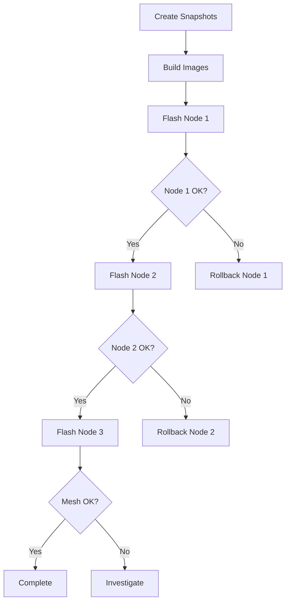

# Firmware Management

This guide covers firmware updates, custom image building, and the sysupgrade process.

## Firmware Types

| Type | Description | Use Case |
|------|-------------|----------|
| **Vanilla** | Stock OpenWrt | Factory reset, fresh start |
| **Mesh** | Custom-built with config | Production deployment |
| **Snapshot** | Development builds | Testing new features |

## Checking Current Firmware

```bash
# On node
cat /etc/openwrt_release

# Via Ansible
ansible mesh_nodes -a "cat /etc/openwrt_release"

# Key version info
DISTRIB_RELEASE="24.10.0"
DISTRIB_REVISION="r28427-6df0e3d02a"
```

## Firmware Updates

### OpenWrt Version Upgrades

Before upgrading:

1. Create full snapshot:

   ```bash
   make snapshot-all
   ```

2. Check release notes for breaking changes

3. Test on one node first

### Upgrade Process

```bash
# Download new OpenWrt release
wget https://downloads.openwrt.org/releases/24.10.0/targets/ramips/mt7621/\
openwrt-24.10.0-ramips-mt7621-dlink_dir-1960-a1-squashfs-sysupgrade.bin

# Verify checksum
sha256sum openwrt-*.bin
# Compare with published checksum

# Flash (wipes config)
make sysupgrade NODE=1 IMAGE_TYPE=vanilla

# Or keep config (risky between major versions)
ssh root@10.11.12.1 'sysupgrade /tmp/openwrt-*.bin'
```

### Post-Upgrade

After vanilla upgrade, redeploy configuration:

```bash
# Wait for node to reboot (192.168.1.1)
make deploy-node NODE=1
```

## Custom Firmware Images

Build firmware with your configuration baked in.

### Prerequisites

1. Node snapshot exists:

   ```bash
   make snapshot NODE=1
   ```

2. Local package repository (optional but recommended):

   ```bash
   make repo-setup
   ```

3. Docker installed for Image Builder

### Build Custom Image

```bash
# Build for single node
make image-build NODE=1

# Build for all nodes
make image-build-all
```

### Image Builder Process

The Image Builder:

1. Downloads OpenWrt Image Builder
2. Extracts your snapshot configuration
3. Includes custom packages
4. Bakes in network/wireless config
5. Produces sysupgrade-ready image

### Output Location

```
images/
├── mesh-node1-sysupgrade.bin      # Node-specific image
├── mesh-node1-sysupgrade.bin.sha256
├── mesh-node2-sysupgrade.bin
├── mesh-node2-sysupgrade.bin.sha256
├── mesh-node3-sysupgrade.bin
└── mesh-node3-sysupgrade.bin.sha256
```

### Image Contents

Custom images include:

| Component | Included |
|-----------|----------|
| OpenWrt base | Yes |
| Kernel modules | Yes (kmod-batman-adv, etc.) |
| Packages | Yes (from snapshot) |
| UCI configuration | Yes (network, wireless, etc.) |
| SSH keys | Yes (authorized_keys) |
| SSH host keys | Yes (identity preserved) |
| Root password | Yes (hashed) |
| Custom scripts | Yes |
| Cron jobs | Yes |

### What's NOT Included

| Component | Reason |
|-----------|--------|
| USB data (/x00) | Too large, device-specific |
| RRD data | Regenerated automatically |
| DHCP leases | Ephemeral |
| Log files | Ephemeral |

## Flashing Firmware

### Using Makefile

```bash
# Flash mesh image (default)
make sysupgrade NODE=1

# Flash vanilla OpenWrt
make sysupgrade NODE=1 IMAGE_TYPE=vanilla

# Flash specific image file
make sysupgrade NODE=1 IMAGE_PATH=/path/to/custom.bin
```

### Manual Flash

```bash
# Upload image
scp mesh-node1-sysupgrade.bin root@10.11.12.1:/tmp/

# Verify upload
ssh root@10.11.12.1 'sha256sum /tmp/*.bin'

# Test image validity
ssh root@10.11.12.1 'sysupgrade -T /tmp/mesh-node1-sysupgrade.bin'

# Flash (with config wipe - recommended for custom images)
ssh root@10.11.12.1 'sysupgrade -n /tmp/mesh-node1-sysupgrade.bin'
```

### Sysupgrade Flags

| Flag | Description |
|------|-------------|
| `-n` | Wipe configuration (fresh start) |
| `-c` | Keep configuration |
| `-v` | Verbose output |
| `-T` | Test image only, don't flash |
| `-F` | Force flash (skip image check) |
| `-b` | Create backup before flashing |

!!! warning
    Always use `-n` with custom images. The config is baked in.

## Factory Reset

Reset node to stock OpenWrt defaults.

### Via Makefile

```bash
make factory-reset NODE=1
```

### Manual Reset

```bash
# On the node (via SSH or console)
firstboot && reboot
```

### Physical Reset Button

On DIR-1960:

1. Power on the router
2. Wait for LEDs to stabilize
3. Press and hold RESET button for 10 seconds
4. LEDs will flash
5. Release button
6. Router reboots to factory defaults

## Image Builder Details

### Container Architecture

```
┌─────────────────────────────────────────────────────────────┐
│                    Docker Container                          │
│  ┌─────────────────────────────────────────────────────┐    │
│  │            OpenWrt Image Builder                     │    │
│  │                                                      │    │
│  │  /builder/                                          │    │
│  │  ├── bin/targets/ramips/mt7621/  (output images)    │    │
│  │  ├── packages/                    (package feeds)   │    │
│  │  ├── files/                       (custom files)    │    │
│  │  └── Makefile                     (build script)    │    │
│  └─────────────────────────────────────────────────────┘    │
│                            │                                 │
│                    Volume Mounts                             │
│                            │                                 │
│  /snapshots  ←──── Host: snapshots/<hostname>/               │
│  /images     ←──── Host: images/                             │
│  /openwrt-repo ←── Host: openwrt-repo/ (optional)            │
└─────────────────────────────────────────────────────────────┘
```

### Build Command Details

```bash
make image PROFILE="dlink_dir-1960-a1" \
  PACKAGES="batman-adv batctl-full wpad-mesh-mbedtls ..." \
  FILES="files/" \
  BIN_DIR="bin/"
```

### Customizing the Build

Edit `docker/image-builder/Dockerfile` or build config:

```bash
# Add extra packages
EXTRA_PACKAGES="nano htop iperf3"

# Use local repository
OPKG_REPO_URL="http://192.168.1.100:8080"
```

## Firmware Verification

### Before Flash

```bash
# Check file size (should be ~7-10MB for DIR-1960)
ls -lh mesh-node1-sysupgrade.bin

# Verify checksum
sha256sum mesh-node1-sysupgrade.bin
cat mesh-node1-sysupgrade.bin.sha256
# Should match

# Test with sysupgrade
scp mesh-node1-sysupgrade.bin root@10.11.12.1:/tmp/
ssh root@10.11.12.1 'sysupgrade -T /tmp/mesh-node1-sysupgrade.bin'
# Should output "Image check passed"
```

### After Flash

```bash
# Wait for reboot (2-3 minutes)

# Check connectivity
ping 10.11.12.1

# Verify version
ssh root@10.11.12.1 'cat /etc/openwrt_release'

# Check mesh status
ssh root@10.11.12.1 'batctl o'

# Run audit
make audit-node NODE=1
```

## Rollback Procedure

If firmware update fails:

### Option 1: Boot to Recovery

Some devices have failsafe mode:

1. Power off
2. Press reset button
3. Power on while holding reset
4. Wait for slow LED blink
5. Connect via 192.168.1.1
6. Flash known-good image

### Option 2: TFTP Recovery

For bricked devices (device-specific):

1. Set up TFTP server on 192.168.0.66
2. Rename firmware to factory.bin
3. Power cycle device
4. Device pulls image via TFTP
5. Wait for reboot

### Option 3: Serial Console

If all else fails:

1. Connect serial cable (3.3V TTL)
2. Settings: 115200 8N1
3. Access U-Boot bootloader
4. Flash via TFTP or USB

## Upgrade Workflow

### Recommended Upgrade Process



### Step-by-Step

```bash
# 1. Create snapshots
make snapshot-all

# 2. Build custom images
make image-build-all

# 3. Flash Node 1
make sysupgrade NODE=1

# 4. Verify Node 1
sleep 120  # Wait for reboot
make check-node NODE=1
make audit-node NODE=1

# 5. Repeat for remaining nodes
make sysupgrade NODE=2
sleep 120
make check-node NODE=2

make sysupgrade NODE=3
sleep 120
make check-node NODE=3

# 6. Verify mesh
make batman-status
make verify
```

## Troubleshooting

### Image Too Large

```
Error: Image too large for flash partition
```

**Solution**: Reduce package list or use external storage

### Image Check Failed

```
Error: Image check failed
```

**Solutions**:

- Verify download wasn't corrupted
- Check device profile matches hardware
- Try re-downloading image

### Boot Loop After Flash

**Symptoms**: LEDs cycling, no network

**Solutions**:

1. Wait 5 minutes (might be first-boot setup)
2. Try failsafe mode
3. Use serial console to access bootloader
4. Flash known-good image via TFTP

### Wrong IP After Mesh Image Flash

**Expected**: 10.11.12.x (baked into image)
**Got**: 192.168.1.1

**Causes**:

- Flash used `-c` flag (kept old config)
- Image build failed to include config

**Solution**: Re-flash with `-n` flag

### SSH Host Key Changed Warning

```
WARNING: REMOTE HOST IDENTIFICATION HAS CHANGED!
```

After fresh flash, the host key changes.

**Solution**:

```bash
# Remove old key
ssh-keygen -R 10.11.12.1

# Or if using custom images with preserved keys, this shouldn't happen
```
